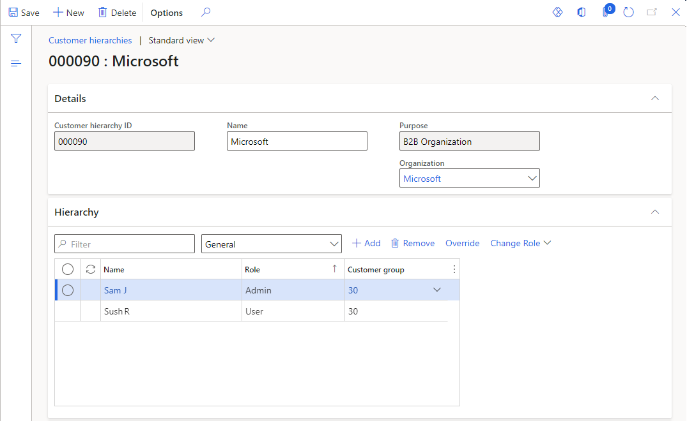
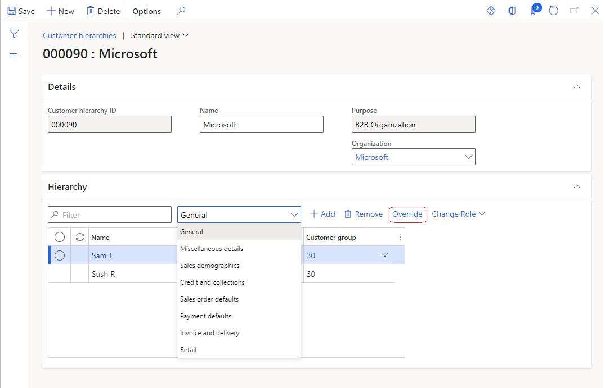

---
# required metadata

title: Manage B2B business partners using customer hierarchies
description: This article describes how to use customer hierarchies to manage business partners for Microsoft Dynamics 365 Commerce business-to-business (B2B) e-commerce websites.
author: josaw1
ms.date: 02/08/2024
ms.topic: article
ms.search.form: RetailOperations
audience: Application User
ms.reviewer: v-chgriffin
ms.search.region: Global
ms.author: josaw
ms.search.validFrom: 2021-01-31

---

# Manage B2B business partners using customer hierarchies

[!include [banner](../../includes/banner.md)]
[!include [banner](../../includes/preview-banner.md)]

This article describes how to use customer hierarchies to manage business partners for Microsoft Dynamics 365 Commerce business-to-business (B2B) e-commerce websites.

In Commerce headquarters, a *customer hierarchy* entity is used to represent the business partner organizations that uses your B2B e-commerce site. Before you can start to use customer hierarchies to manage business partners, you must enable the B2B e-commerce capabilities in Commerce headquarters and then define a number sequence for the customer hierarchy.

## Enable the B2B e-commerce feature in Commerce headquarters

To use the B2B e-commerce capabilities, you must first enable the **Enable the use of B2B eCommerce capabilities** feature in Commerce headquarters.

1. Go to **Workspaces \> Feature management**.
1. On the **All** tab, use the filter box to search for **Module: Retail and Commerce**.
1. Find the **Enable the use of B2B eCommerce capabilities** feature, select it, and then select **Enable now** in the lower-right corner.

For a business buyer to successfully sign up on the website, you must first enable the automatic linking feature, which links their Commerce customer account to the email address they used to request onboarding. 

To enable the automatic linking feature, follow these steps:

1. Go to **System administration \> Workspaces \> Feature management** and select the **All** tab. 
1. Search for the feature named **Local Identity Record and Commerce Customer automatic linking**.
1. Select the feature, and then in the properties pane, select **Enable now**.

> [!NOTE]
> For automatic linking to be successful, you must run the **1010 (Customers)** distribution schedule job before the customer signs in to the website. Once enabled, the automatic linking feature is enabled for all channels in your environment, which is important to be aware of if you are hosting different types of sites within your environment.

For more information, see [Automatic linking on B2B sites](../dev-itpro/identity-record-linking.md#automatic-linking-on-b2b-sites) to learn more.

## Define a number sequence for the customer hierarchy

Number sequences are used to generate readable, unique identifiers for master data records and transaction records that require identifiers. You must define a number sequence that is used to generate the ID for the customer hierarchy. For more information about number sequences, see [Number sequences overview](/dynamics365/fin-ops-core/fin-ops/organization-administration/number-sequence-overview).

To define a number sequence for the customer hierarchy in Commerce headquarters, follow these steps.

1. Go to **Retail and Commerce \> Headquarters setup \> Number sequences \> Number sequences**.
1. Create a new number sequence, or select an existing number sequence to reuse it.
1. Go to **Retail and Commerce \> Headquarters setup \> Parameters \> Commerce shared parameters**.
1. On the **Number sequences** tab, add the number sequence that you created or selected earlier to the **Customer hierarchy ID** reference.

## How the approval process works

When a business partner requests to join a B2B e-commerce site, the system saves the request as a *prospect*. A Commerce headquarters persona such as a retail operations manager can approve or reject partner requests. For more information about how to manage business partner requests and prospect approvals, see [Manage business partner users on B2B e-commerce websites](manage-b2b-users.md).

When a prospect is approved, the system creates two new customer records:

- One customer record of the **Organization** type represents the organization that is requesting to become a business partner.
- One customer record of the **Person** type represents the person who submitted the request.

In addition, a new customer hierarchy record is created at **Retail and Commerce \> Customers \> Customer hierarchies**. This customer hierarchy record has the following properties:

- **Customer hierarchy ID** – The unique ID of the customer hierarchy. This ID uses the number sequence that you defined in Commerce shared parameters.
- **Name** – The organization name of the business partner, as specified in the onboarding request. This field is editable.
- **Purpose** – This property is set to the predefined value **B2B organization**.
- **Organization** – The customer ID of the business partner organization.

The person who submitted the onboarding request is added on the **Hierarchy** FastTab, and the **Admin** role is assigned to them. As the administrator adds more users to the business partner organization on a B2B site, a new customer record is created for each user. The customer record is also added to the relevant customer hierarchy record for the business partner, and the **User** role is assigned to it.

### Examples

A person who is named Sam J. submits an onboarding request on behalf of the Microsoft organization. After the request is approved, two new customer accounts are created: one of the **Person** type for Sam J. and one of the **Organization** type for Microsoft.

As the example in the following illustration shows, a new customer hierarchy record is also created. This record has the same name as the organization (**Microsoft**), and the **Admin** role is assigned to Sam J. As the administrator, Sam J. adds any other Microsoft users of the B2B site to this hierarchy and assigns the **User** to them. In this example, Sush R. is added as a user.

To determine whether a customer is associated with a customer hierarchy, open the customer record. As the example in the following illustration shows, the **Customer hierarchy ID** field in the **B2B** section on the **Retail** FastTab shows whether the customer is part of a customer hierarchy, and the **B2B administrator** option indicates whether the customer is an administrator of that hierarchy.

In most cases, the property values of all customer records in a hierarchy should match. For example, because all business partner users should get similar prices for products, their price group and associated configurations should match. However, the system doesn't enforce this consistency. Therefore, the relevant Commerce headquarters users are responsible for ensuring that the property values and configurations match for all customers in a given hierarchy.

Commerce headquarters users can inspect property values for all customer records in a hierarchy in a side-by-side view. As the example in the following illustration shows, you can use the **General** option in the drop-down list on the **Hierarchy** FastTab and then select any section of the customer record to show the related properties. Users can edit the property values directly in this view. To copy all the values from an administrator customer record to all users, select **Override** on the **Hierarchy** FastTab.

## Control access to the B2B ecommerce site

When a business partner is onboarded to a B2B e-commerce site, by default the business partner has access to all B2B e-commerce sites under the same organization. To be able to restrict business partner access to B2B ecommerce sites, starting in Commerce version 10.0.38 administrators can associate online B2B channels with the customer hierarchy of a business partner. If no channel is associated with the business partner's customer hierarchy, then the business partner can access all of the B2B e-commerce sites under the same organization.

The following example image shows the customer hierarchy of a business partner in headquarters with the associated retail channel highlighted.

[!include [footer-include](../../includes/footer-banner.md)]
