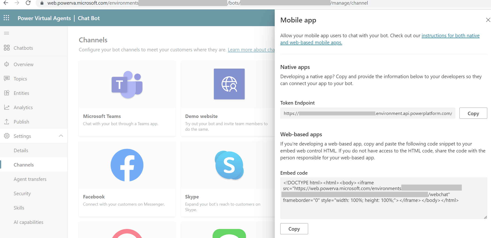
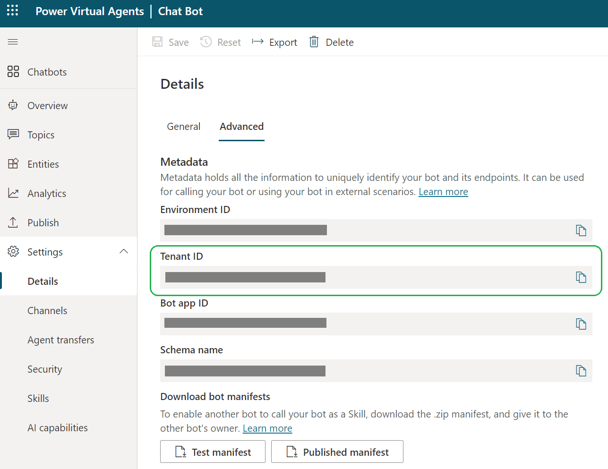

---
# required metadata

title: Commerce Chat with Power Virtual Agents module
description: This article describes the Commerce Chat with Power Virtual Agents module that integrates Microsoft Power Virtual Agents with Dynamics 365 Commerce websites.
author: gvrmohanreddy
ms.date: 10/18/2022
ms.topic: article
audience: Application User, Developer, IT Pro
ms.reviewer: v-chgriffin
ms.search.region: Global
ms.author: gmohanv
ms.search.validFrom: 2022-09-07

---

# Commerce Chat with Power Virtual Agents module

[!include [banner](includes/banner.md)]

This article describes the Commerce Chat with Power Virtual Agents module that integrates Microsoft Power Virtual Agents with Dynamics 365 Commerce websites.

The Commerce Chat with Power Virtual Agents feature empowers Dynamics 365 e-commerce customers to use Power Virtual Agents chatbot capabilities to handle their queries. As of the Dynamics 365 Commerce 10.0.30 release, this feature can be incorporated into e-commerce websites by using the Commerce Chat with Power Virtual Agents module that is part of the Commerce module library.

The Commerce Chat with Power Virtual Agents feature helps businesses achieve the following goals:

- Increase personalized engagement with their consumers, and improve retention.
- Increase customer service through integration of self-service chatbots.
- Increase overall customer satisfaction, and therefore increase sales.

> [!NOTE]
> To learn about the differences between the Dynamics 365 Omnichannel for Customer Service and Power Virtual Agents applications, see [Commerce chat modules overview](/commerce-chat-modules-overview.md).

## Prerequisites for using Power Virtual Agents

To use the Commerce Chat with Power Virtual Agents feature, you must first create a Power Virtual Agents chatbot for your e-commerce website. For instructions, see [Create a power virtual agent bot](/power-virtual-agents/authoring-first-bot).

After you configure the chatbot, you must copy the values of **Bot ID** and **Tenant ID** chatbot parameters to configure the Commerce chat experience.

### Find Bot ID
1. In the navigation menu, under **Settings** tab, choose **Channels**
2. Click **Mobile app**
3. Copy the **Token Endpoint**. The endpoint URL is like https://environment-id.04.environment.api.powerplatform.com/powervirtualagents/bots/bot-id/directline/token?api-version=2022-03-01-preview. The Bot ID is a GUID between **/bots/** and **/directline/** in the URL.

### Find Tenant ID
1. In the navigation menu, under **Settings** tab, choose **Details**
2. Choose **Advanced**
3. Copy the **Tenant ID**

Please note that "Bot app ID" is not "Bot ID".

For more information about how to copy these values, see [Retrieve your Power Virtual Agents bot parameters](/power-virtual-agents/publication-connect-bot-to-custom-application#retrieve-your-power-virtual-agents-bot-parameters).

## Configure your e-commerce site 

One recommended way to implement the chat experience for your e-commerce site is to add the Commerce Chat with Power Virtual Agents module to the shared header fragment that is used on your site pages.

To add the chat module to your site's header fragment in Commerce site builder, follow these steps.

1. In Commerce site builder for your site, go to **Fragments**.
1. Select **New**.
1. In the **Select a fragment** dialog box, select the **Commerce Chat with Power Virtual Agents** module, enter a name for the fragment, and then select **OK**.
1. In the outline view, select the **Msdyn365 pva chat connector** slot.
1. In the properties pane on the right, follow these steps:

    1. Under **Bot Parameters**, in the **Bot Framework Webchat Chat CDN URL** field, leave the default value (for example, `https://cdn.botframework.com/botframework-webchat/latest/webchat.js`).
    1. In the **Bot Framework Direct Line Authentication URL** field, leave the default value (for example, `https://powerva.microsoft.com/api/botmanagement/v1/directline/directlinetoken`).
    1. In the **Bot ID** field, enter the Power Virtual Agents **Bot ID** value that you copied in the [Prerequisites for using Power Virtual Agents](#prereq) section.
    1. In the **Tenant ID** field, enter the **Tenant ID** value that you copied.

1. Select **Save**, select **Finish editing** to check in the fragment, and then select **Publish** to publish it.
1. Go to **Fragments**, and open the header fragment for your site.
1. In the **Default container** slot, select the ellipsis (**...**), and then select **Add fragment**.
1. In the **Select modules** dialog box, select the chat fragment that you created earlier, and then select **OK**.
1. Select **Save**, select **Finish editing** to check in the fragment, and then select **Publish** to publish it.

## Proactive chat parameters

For a complete list of proactive chat configuration parameters, see [Commerce chat module proactive chat parameters](chat-proactive-chat-parameters.md).

> [!NOTE]
> Currently, Power Virtual Agents doesn't support Azure Active Directory B2C (Azure AD B2C) authentication. It supports only anonymous Retail Cloud Scale Unit (RCSU) calls to get product availability or interact with other anonymous APIs. Calls to authenticated APIs via Power Virtual Agents chatbots require an explicit customer sign-in.

## Additional resources

[Commerce chat features overview](commerce-chat-overview.md)

[Commerce Chat with Omnichannel for Customer Service module](commerce-chat-module.md)

[Commerce chat module proactive chat parameters](chat-proactive-chat-parameters.md)
