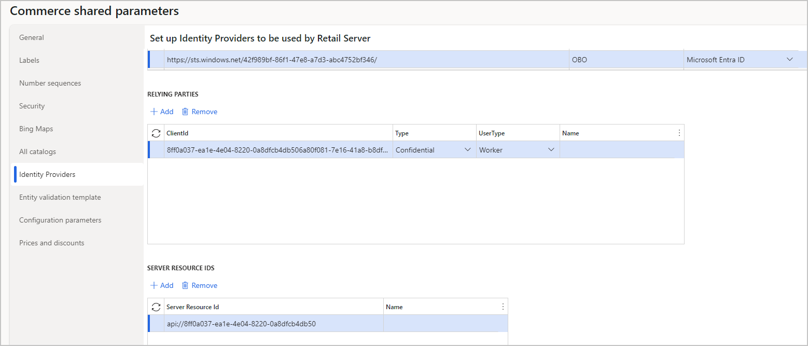

---
# required metadata

title: Set up and configure on behalf of (OBO) functionality in headquarters
description: This article describes how to set up and configure on behalf of (OBO) functionality in Microsoft Dynamics 365 Commerce headquarters.
author: mariash529
ms.date: 08/09/2023
ms.topic: article
audience: Application User, Developer, IT Pro
ms.reviewer: v-chgriffin
ms.search.region: Global
ms.author: mashneer
ms.search.validFrom: 2023-02-27
ms.dyn365.ops.version: 10.0.33

---

# Set up and configure on behalf of (OBO) functionality in headquarters

[!include [banner](includes/banner.md)]

This article describes how to set up and configure on behalf of (OBO) functionality in Microsoft Dynamics 365 Commerce headquarters.

## Add identity providers to Commerce shared parameters

First, you must add the identity provider that you created in [Create and configure an Azure AD application for account manager sign-in](obo-create-aad-application.md) to **Commerce shared parameters** in Commerce headquarters.

To add identity providers to Commerce shared parameters in headquarters, follow these steps.

1. Go to **Retail and Commerce \> Headquarters setup \> Parameters \> Commerce Shared parameters \> Identity Providers**.
1. Under **Identity providers**, select **Add**, and then set the following fields:

    1. **Issuer:** Enter `https://sts.windows.net/<TENANTID>`, where `<TENANTID>` is the ID of your Azure Active Directory (Azure AD) business-to-business (B2B) tenant.
    1. **Type:** Select **Azure Active Directory**.
    1. **Name:** Enter a name for the identity provider.

1. Under **Relying parties**, select **Add**, and then set the following fields:

    1. **ClientID:** Enter the client ID of Azure AD B2B application (for example, "8ff0a037-ea1e-4e04-8220-0a8dfcb4db50").
    1. **Type:** Select **Confidential**.
    1. **User Type:** Select **Worker**.

1. Under **Server resource IDs**, select **Add**, and then set the following fields:

    1. **Server Resource Id:** Enter `https://<APPLICATIONIDURI>`, where `<APPLICATIONIDURI>` is the ID of the Azure AD B2B application (for example, "api://8ff0a037-ea1e-4e04-8220-0a8dfcb4db50".)
    1. **Name:** Leave this field blank.
  
1. On the action pane, select **Save**.

    

1. Go to **Retail and Commerce \> Headquarters setup \> Distribution schedule**.
1. In the left navigation menu, select the **1110 Global configuration** job.
1. On the action pane, select **Run Now**.

## Create and configure a sales group

Next, you must create and configure a sales group in headquarters. For information about how to create sales groups, see [Create a commission sales group for the worker](tasks/worker.md#create-a-commission-sales-group-for-the-worker).

Create a sales group of one or more account managers. For OBO functionality to work, the sales group must include, at a minimum, a sale representative. Assign commission percentages, if your organization assigns commissions. A commission percentage can equal 0 (zero).

### Associate a sales group with a B2B buyer organization

To associate a sales group with a B2B buyer organization in headquarters, follow these steps.

1. Go to **Sales and Marketing \> Customers \> All customers**.
1. Find the customer of the **Organization** type that must be managed by the sales group that you created (for example, **Contoso B2B**), and then select its name or account number.
1. On the **Sales order defaults** FastTab, under **Sales group**, enter the sales group ID of the sales group that you created.
1. On the Action Pane, select **Save**.

Any member of the specified sales group will now be able to work on behalf of any user in the selected customer B2B buyer organization.

In the customer hierarchy that corresponds to this customer organization (**Retail and Commerce \> Customers \> Customer hierarchies**), the sales group should now be shown as a read-only value in the **Sales Groups** section.

## Initialize Commerce scheduler

To initialize the Commerce scheduler to complete the synchronization of sales representatives in headquarters, follow these steps.

1. Go to **Retail and Commerce \> Headquarters setup \> Commerce scheduler \> Initialize Commerce scheduler**.
1. Set **Delete existing configuration** to **No**.
1. Set **Update subjobs only** to **No**.
1. Select **OK**. 

## Additional resources

[Create and configure an Azure AD application for account manager sign-in](obo-create-aad-application.md)

[Create and modify pages for on behalf of (OBO) functionality](obo-add-pages-site-builder.md)

[Update Commerce headquarters with the new Azure AD B2C information](update-hq-aad-b2c-info.md)

[Configure a worker](tasks/worker.md)

[Enter worker information](../human-resources/hr-personnel-enter-worker-information.md)
