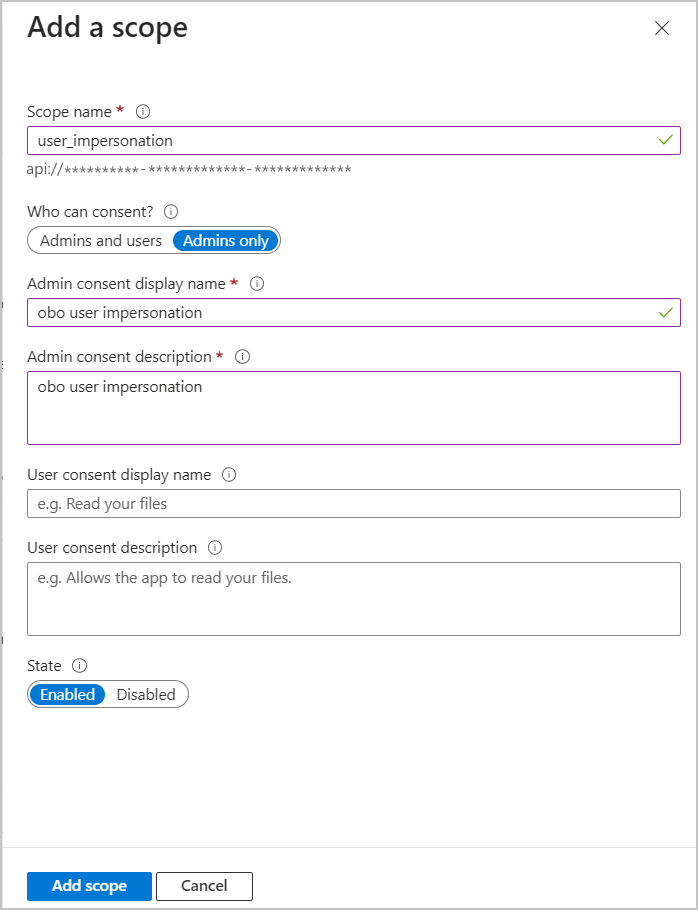
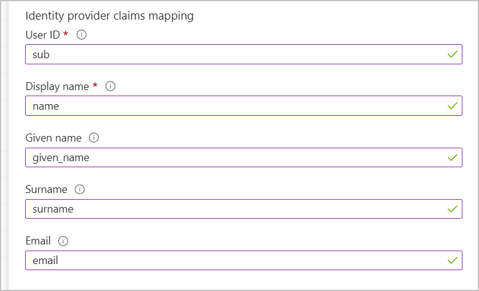

---
# required metadata

title: Create and configure an Azure AD application for account manager sign-in
description: This article describes how to create and configure an Azure Active Directory (Azure AD) application for account manager sign-in for on behalf of (OBO) functionality in Microsoft Dynamics 365 Commerce.
author: mariash529
ms.date: 09/22/2023
ms.topic: article
audience: IT Pro
ms.reviewer: josaw
ms.search.region: Global
ms.author: mashneer
ms.search.validFrom: 2023-02-27
ms.dyn365.ops.version: 10.0.33

---

# Create and configure an Azure AD application for account manager sign-in 

[!include [banner](includes/banner.md)]

This article describes how to create and configure an Azure Active Directory (Azure AD) application for account manager sign-in for on behalf of functionality (OBO) in Microsoft Dynamics 365 Commerce.

## Create an Azure AD application for account manager sign-in in the Azure B2B tenant

To create an Azure AD application for account manager sign-in in the Azure business-to-business (B2B) tenant, follow these steps.

1. Sign in to the [Azure portal](https://portal.azure.com/).
1. Go to the directory that contains the Azure AD business-to-business (B2B) tenant that's being used for sign-in in headquarters.
1. In the row of Azure services, select **Azure Active Directory**.
1. On the **Manage** menu, select **App Registration**, and then select **New Registration**.
1. Enter a name for the application (for example, **Account Manager Employer Auth**).
1. Under **Supported account types**, select **Accounts in this organizational directory only (`<YOUR-TENANT-NAME>` only - Single tenant)**, where `<YOUR-TENANT-NAME>` is the name of your tenant.
1. Under **Redirect URI**, select **Web**, and then, in the URL field, enter `https://<your-tenant-name>.b2clogin.com/<your-tenant-name>.onmicrosoft.com/oauth2/authresp`, where `<your-tenant-name>` is the name of your tenant. If you use a custom domain, enter `https://<your-domain-name>/<your-tenant-name>.onmicrosoft.com/oauth2/authresp`, where `<your-domain-name>` is your custom domain.

    > [!NOTE]
    > Use lowercase letters when you enter your tenant's name, even if the tenant is defined with uppercase letters in Azure AD B2C. For example, enter `https://adventure-works.b2clogin.com/adventure-works.onmicrosoft.com/oauth2/authresp`.

1. Select **Register**.

## Configure an Azure AD application for account manager sign-in in the Azure B2B tenant

After you complete the registration, locate the application that you created (for example, **Account Manager Application**).

1. In the **Essentials** section, copy and save the **Application (Client) ID** value. This value is a globally unique identifier (GUID) (for example, "88760a037-ea1e-4e04-8e50-0a8dfcb4eb50").
1. Select **Add an Application ID URI**.
1. Select **Add a scope**. An application ID URI is generated for you.
1. Select **Save and continue**.
1. For **Scope name**, enter "user_impersonation".
1. For **Admin consent display name**, enter "obo user impersonation", or any other name.
1. For **Admin consent description**, enter "obo user impersonation", or any other description.
1. Select **Save**.
1. On the left menu, under **Manage**, select **Certificates & secrets**.
1. Select **New client secret**.
1. In the **Description** field, enter a description of the client secret (for example, "clientsecret1").
1. Under **Expires**, select the date when the secret expires.
1. Select **Add**.
1. Copy and save the secret value to use later. 

    > [!IMPORTANT]
    > The secret value is never shown again after you leave the **Certificates & secrets** page. Therefore, be sure to copy it.

 

## Configure an identity provider in your Azure B2C tenant for account manager sign-in to a B2B site

To configure an identity provider in your Azure B2C tenant for account manager sign-in to a B2B site, follow these steps.

1. Go to the directory that contains your Azure AD B2C tenant. On the top menu, select the **Directory + subscription** filter, and then select the directory that contains your Azure AD B2C tenant.
1. In the upper-left corner of the Azure portal, select **All services** , and then search for and select **Azure AD B2C**.
1. Select **Identity providers**, and then select **New OpenID Connect provider**.
1. In the **Name** field, enter "Account Manager B2B Sign-in". This exact name is required and can't be modified. 
1. In the **Metadata url** field, enter the URL of the Azure B2B OpenID Connect (OIDC) configuration document (for example, `https://login.microsoftonline.com/<TENANT-ID>/v2.0/.well-known/openid-configuration`, where `<TENANT-ID>` is the ID of your Azure AD B2B tenant). 

    > [!IMPORTANT]
    > The OIDC configuration document URL must use HTTPS.

1. In the **Client ID** field, enter the application ID that you copied earlier.
1. In the **Client secret** field, enter the client secret that you copied earlier.
1. In the **Scope** field, enter "openid profile `<Azure-B2B-Application-ID-URI>`/user_impersonation", where `<Azure-B2B-Application-ID-URI>` is the ID of the Azure B2B Azure AD application (for example, "openid profile api://88760a037-ea1e-4e04-8e50-0a8dfcb4eb50/user_impersonation"). The **Scope** field format must be "openid profile `<scope-name>`", where `<scope-name>` is the scope name you created in the [Create an Azure AD application for account manager sign-in in the Azure B2B tenant](#create-an-azure-ad-application-for-account-manager-sign-in-in-the-azure-b2b-tenant) procedure. 
1. In the **Response type** field, select **code**.
1. In the **Response mode** field, select **form\_post**.  
1. Under **Identity provider claims mapping**, select the following claims:
 
    1. For **User ID**, select **sub**.
    1. For **Display name**, select **name**.
    1. For **Given name**, select **given\_name**.
    1. For **Surname**, select **family\_name**.
    1. For **Email**, select **email**.
1. Select **Save**.

## Add the Azure identity provider to a user flow

To add the Azure identity provider to a user flow, follow these steps.

1. In your Azure AD B2C tenant, select **User flows**.
1. Select the user flow that you want to add the identity provider to.
1. Under the **Custom identity providers**, select the identity provider that you added in the [Create an Azure AD application for account manager sign-in in the Azure B2B tenant](#create-an-azure-ad-application-for-account-manager-sign-in-in-the-azure-b2b-tenant) procedure.
1. In **Application Claims**, select **Identity Provider Access Token**, **Identity Provider**, **Email address**, **Given Name**, and **Surname**.
1. Select **Save**.

## Additional resources

[Create and modify pages for on behalf of (OBO) functionality](obo-add-pages-site-builder.md)

[Set up a B2C tenant in Commerce](set-up-b2c-tenant.md)

[Set up custom pages for user sign-ins](custom-pages-user-logins.md)
