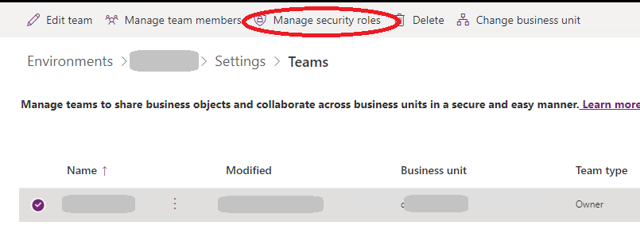
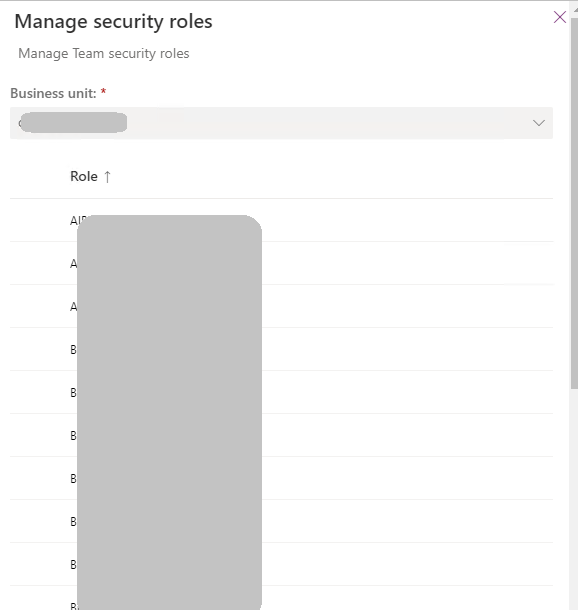

# Set up dual-write security roles and permissions

This article describes the special security roles and permissions that are required for dual-write to work as expected.

## Assign security roles to Microsoft Dataverse users

All Microsoft Dataverse users should be added to the **dual-write runtime configuration** security role.

## Assign security role to the default owning team

In Dataverse, each business unit has a default owning team that uses the same name as the business unit. This team should be assigned to a security role that gives read permissions to all Dataverse tables that participate in dual-write. For information about how to set up the security role, see [Manage the security roles of a team](/power-platform/admin/manage-teams#manage-the-security-roles-of-a-team). Global tables are associated with the root business unit.

To find the root business unit and default teams, follow these steps.

1. In a web browser, sign in to the Dataverse or Customer Engagement apps environment (for example, `https://[environment].dynamics.com`). Replace **\[businessunitid\]** with your environment's name.
2. Open a new browser tab, and enter the following URL.

    `https://[environment].dynamics.com/api/data/v9.0/businessunits?$select=name,businessunitid&$filter=_parentbusinessunitid_value%20eq%20null`

    The result will resemble the following example.

    ```
    {
        "@odata.context": "https://???.dynamics.com/api/data/v9.0/$metadata#businessunits(name,businessunitid)",
        "value": [
            {
                "@odata.etag": "W/\"...\"",
                "name": "[***]",
                "businessunitid": "????????-????-????-????????"
            }
        ]
    }
    ```

3. Find the **businessunitid** property, and record the value.
4. Open a new browser tab, and enter the following URL. Replace **\[businessunitid\]** with the value that you recorded in step 3.

    `https://???.dynamics.com/api/data/v9.0/teams?$select=name,teamid&$filter=_businessunitid_value%20eq%20[businessunitid]%20and%20isdefault%20eq%20true`

    The result will resemble the following example.

    ```
    {
        "@odata.context": "https://[environment].dynamics.com/api/data/v9.0/$metadata#teams(name,teamid)",
        "value": [
            {
                "@odata.etag": "W/\"...\"",
                "name": "[***]",
                "teamid": "...",
                "ownerid": "..."
            }
        ]
    }
    ```

The value of the **name** property is the default team of the root business unit. Use it to assign the security role.

## What if you missed the security setup for the default owning team?

When dual-write is invoked to propagate data changes from finance and operations apps to Dataverse, it uses the specific team as the owner of the record that will be dual-written in Dataverse. If the security role that has read permissions isn't assigned, the Dataverse table throws an exception, and you receive an error message that resembles the following example:

> Unable to write data to table<br>
> ...<br>
> Principal team (Id=\*\*\*, ..., is missing prvReadcol\_\*\*\* privilege (Id=\*\*\*) on OTC=\*\*\*.

If the exception occurs, follow these steps to assign the correct permissions to the team so that dual-write can work as expected.

1. In a web browser, sign in to the Dataverse environment (for example, `https://[environment].dynamics.com`). Replace **\[businessunitid\]** with your environment's name.
2. Open a new browser tab, and enter the following URL. Replace **\[ID\]** with the ID that's shown in the error message.

    `https://[environment].crm.dynamics.com/api/data/v9.0/teams?$select=name&$filter=teamid eq [ID]`

3. Record the **name** value for the team.
4. Sign in to [Power Platform admin center](https://admin.powerplatform.microsoft.com/environments).
5. On the **Environments** page, find and select the Power Apps environment that's associated with the Dataverse environment.

    

6. On the **Access** tab, in the **Teams** section, select **See all**.

    

7. Select the team name that matches the **name** value that you recorded in step 3.
8. On the toolbar, select **Manage Security Roles**.

    

9. In the list of the security roles, select a role that has read permissions to the Dataverse table. Alternatively, you can create a custom security role that has read permissions to the Dataverse table and then select it in the list of security roles.

    

For more information about Dataverse security roles and privileges, see [Configure user security to resources in an environment](/power-platform/admin/database-security).
