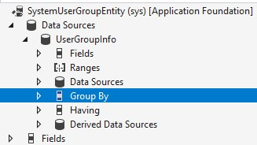
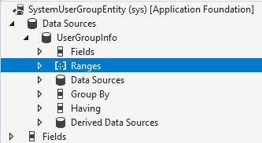
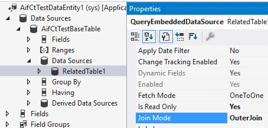
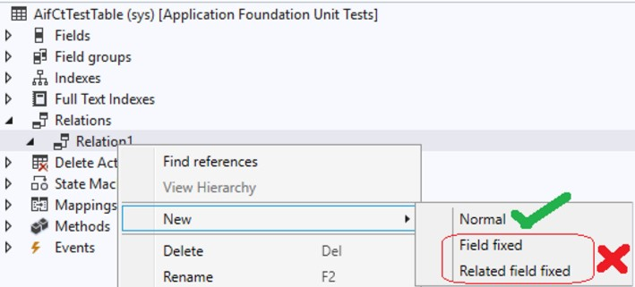

# Row version change tracking for tables and data entities

A new change tracking functionality called row version change tracking has been added to finance and operations apps. This option enables Microsoft Dataverse to be used for incremental synchronization of data. Change tracking is a prerequisite for several features, such as Data archival, Synapse integration, Mobile offline, and Relevance search. The eventual goal is to unify all existing finance and operations data synchronization frameworks into one that is based on Dataverse synchronization services.

In row version change tracking functionality, a new column of type [rowversion](https://learn.microsoft.com/sql/t-sql/data-types/rowversion-transact-sql?view=sql-server-ver16) needs to be added to all tables in the data entity that requires change tracking. The [rowversion](https://learn.microsoft.com/sql/t-sql/data-types/rowversion-transact-sql?view=sql-server-ver16) column performs version stamping of table rows. SQL Server maintains a database-level counter that is incremented for each insert or update operation. Changes to a table row can be detected by comparing the current value in the [rowversion](https://learn.microsoft.com/sql/t-sql/data-types/rowversion-transact-sql?view=sql-server-ver16) column with the previous value. 

## Enable row version change tracking functionality

Beginning in Microsoft Dynamics Finance 10.0.34, it's required to enable the **Sql row version change tracking** configuration key on the **License configuration** page, **System administration > Setup > Licensing > License configuration**. Configuration keys can only be edited in maintenance mode, see [Maintenance mode](../sysadmin/maintenance-mode.md). After enabling **Sql row version change tracking** configuration key, during exit of [Maintenance mode](../sysadmin/maintenance-mode.md) the Database synchronization will add [rowversion](https://learn.microsoft.com/sql/t-sql/data-types/rowversion-transact-sql?view=sql-server-ver16) column to tables that are enabled for row version change tracking.

> [!NOTE]
> The [rowversion](https://learn.microsoft.com/sql/t-sql/data-types/rowversion-transact-sql?view=sql-server-ver16) column is read-only in SQL Server. Therefore, direct SQL DML statements executed using the X++ [Statement](https://learn.microsoft.com/en-us/dotnet/api/dynamics.ax.application.statement.executeupdate) object, such as the following example, will break if they try to insert or update this column.
>
> ```SQL
> INSERT INTO table2
> SELECT * FROM table1
> ```
> Hence enable the configuration key in your sandbox environment first and validate, before enabling the configuration key in production. In the unlikely event that direct SQL DML statements are trying to insert or update the column, it will be required to disable the **Sql row version change tracking** configuration key until the issue is resolved.
>
> To resolve the issue, the direct SQL DML statement in the X++ code needs to be modified to explicitly specify column list for source and destination tables in the SQL DML statement, such as the following example.
>
> ```SQL
> INSERT INTO table2 (Column1, Column2)
> SELECT ColumnA, ColumnB FROM table1
> ```
> 
## Enable row version change tracking for tables

To enable row version change tracking for a table, set the **Allow Row Version Change Tracking** property of the table to **Yes**. When **Allow Row Version Change Tracking** property of a table is set to **Yes**, the table gets a new system field called **SysRowVersion** of type [rowversion](https://learn.microsoft.com/sql/t-sql/data-types/rowversion-transact-sql?view=sql-server-ver16).

> [!NOTE]
> Before 10.0.34 when the row version change tracking functionality was in preview, the row version column was called **SysRowVersionNumber**. Beginning in 10.0.34 **SysRowVersionNumber** column was replaced with new **SysRowVersion** column. The **SysRowVersionNumber** column is obsolete. The **SysRowVersionNumber** column will be removed from metadata of out of the box tables in 10.0.39. Hence do not take any dependency on **SysRowVersionNumber** column in your X++ code.
> 

## Enable row version change tracking for data entities

To enable row version change tracking for a data entity, set **Allow Row Version Change Tracking** property of the data entity to **Yes**. Not all existing data entities are configured to support row version change tracking. The main limiting factor is the complexity of the data entities. When **Allow Row Version Change Tracking** is set to **Yes** for a data entity, validation rules are evaluated at build time.

The following table describes the data entity validation rules.

| Rule | Comments | Error message |
|------|----------|---------------|
| Data entities that have a custom change tracking query aren't supported. | | Change tracking cannot be enabled since the F&O entity '{0}' uses a custom query. |
| Data entities that have range filters aren't supported. | <p>Range filters can cause records to be filtered out from the view. In this case, the change won't be tracked as a deletion.</p>[](./media/DERanges.jpg) | Change tracking cannot be enabled since the F&O entity '{0}' contains Ranges. |
| Data entities where the data sources have a group-by condition aren't supported. | [](./media/DataSourceGroupBy.jpg) | Change tracking cannot be enabled since the F&O entity '{0}' contains Group By condition. |
| The count of data sources in a data entity must be below the threshold. | You will receive a warning when the threshold is exceeded by 10, and when it's exceeded by 5. This count is configurable up to a maximum of 10. This limit helps improve performance. | Change tracking can't be enabled because the F&O entity %1 contains more than %2 data sources. |
| Data entities where the data sources have range filters aren't supported. | [](./media/DataSourceRangesjpg.jpg) | Change tracking cannot be enabled since the data source '{0}' in the F&O entity '{1}' contains Ranges.  |
| Data entities that have non-table data sources aren't supported. | Nested data entities or data entities that contain views as data sources aren't supported. | Change tracking cannot be enabled since the data source '{0}' in the F&O entity '{1}' is not a table. |
| All tables in a data entity must allow for row version change tracking. | [](./media/AllowRowVersionChangeTracking.jpg) | Change tracking cannot be enabled since the **Allow Row Version Change Tracking** property is not set to **Yes** for the table '{0}' in the F&O entity {1}.|
| Data sources in a data entity must be joined by using an outer join and the join column(s) from the related data source should be immutable. | <p>Inner joins and exists joins aren't supported. Non-outer joins can cause records to be filtered out of the view. In this case, the change won't be tracked as a deletion.</p>[](./media/OuterJoinMode.jpg) | Change tracking cannot be enabled since the Join Mode defined in the data source '{0}' in the F&O entity '{1}' is not Outer Join. <br /> Change tracking cannot be enabled since the join column(s) from related table '{0}' are not immutable.| 
| The relationship between data sources must be many to one. | One-to-many relationships aren't supported. A one-to-many relationship will generate duplicate virtual table **entityid** values. | Change tracking cannot be enabled since the Relation '{0}' between data sources defined in the F&O entity '{1}' is one-to-many. |
| Only normal relation constraints are supported for data sources in a data entity. | [](./media/DataSourceRelations.jpg) | Change tracking cannot be enabled since the Relation '{0}' between the data sources in the F&O entity '{1}' is not set to Normal. |
| Validate data entities that have time state–enabled tables. | Root tables that have an **Apply Date** filter aren't supported, because they can cause record disappearance. Time state tables aren't supported for related data sources, because they can cause either record disappearance or one-to-many relationships. | Change tracking cannot be enabled since the data source table '{0}' in F&O Data Entity '{1}' has a time state enabled.<br>Change tracking cannot be enabled since the root data source '{0}' in the F&O entity '{1}' contains a date effective filter. |

ISVs and partners are recommended to always create new data entities when enabling row version change tracking. This is to avoid risks of existing custom extensions violating the validation rules. Validation rule failures from custom extensions are surfaced as build warning instead of error to prevent back compatibility break.

When **Allow Row Version Change Tracking** is set to **Yes** for a data entity, the **SysRowVersion** column from underlying datasource(s) are added to the data entity view. 

## Track deletions and cleanup

Data entity row deletions are tracked by using the **AifChangeTrackingDeletedObject** table.

A system batch job that is named **Delete tracking history clean-up** cleans up any records in the **AifChangeTrackingDeletedObject** table that have exceeded the retention period. Records are deleted in batches until the time-out criterion is reached. By default, the job runs every day at 1:00 AM. However, you can configure the recurrence and frequency of the job at **System Administration \> Batch Jobs**. Currently, the retention period is 10 days.

## Retrieve entity changes

This change tracking feature is fully compatible with Dataverse change tracking; however, there are some differences. For example, changes for finance and operations apps are returned if the last token is within the default value of 10 days, not the value of 90 days that is used for Dataverse tables. For more information, see [Use change tracking to synchronize data with external systems](/power-apps/developer/data-platform/use-change-tracking-synchronize-data-external-systems). 

[!INCLUDE[footer-include](../../../includes/footer-banner.md)]
