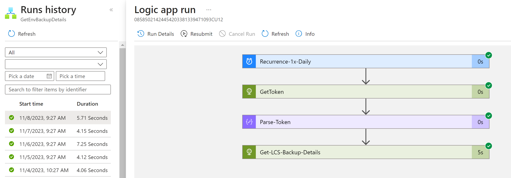

# Tutorial: Retrieve environment metadata via Logic Apps

This tutorial is aimed at enabling customers to take advantage of the Lifecycle Services API to periodically scan their environments and capture the metadata details. 

In this tutorial, you'll learn how to:

1.	Create a Power Automate or Logic Apps workflow (Azure) that authenticates with Lifecycle Services API. 
2.	Call the Environment Metadata endpoint to retrieve the details about a given environment. 

In this example scenario, a Customer requires to know the database backup location and if a backup was taken daily for their audit and compliance needs.  This can be retrieved using the steps below.

## Step 1: Create the workflow and set up the variables
To start off, in this tutorial we'll use a Logic Apps workflow.  A Power Automate flow is also acceptable, and any other orchestration engine that your company prefers to use for automation.  All of the calls to retrieve the data will be using RESTful APIs so any tooling that supports REST will work with this tutorial.

Visit the Azure portal, and then create a new logic app and give it a name:

> [!div class="mx-imgBorder"] 
> ")

After that finishes provisioning, edit the workflow using the Designer and set up a Recurrence trigger to run on schedule of your choosing:

> [!div class="mx-imgBorder"] 
> 

For the remainder of this tutorial, you'll need a Project ID and an environment ID to complete the subsequent steps:
- **Environment Id**: The ID of the environment to which you would install the package. This is found on the environment details page in LCS.
- **Project ID**: The ID of the project where the environment resides.  This is found in the URL of the environment details page.

Next we'll authenticate with Microsoft Azure Active Directory (Azure AD) and retrieve a token for calling the Lifecycle Services API.  If you haven’t completed your Azure AD setup, see [Authentication (preview)](../../database/api/dbmovement-api-authentication.md).

In this tutorial, we're using a user credential with password to obtain a token.  An example call to Azure AD is below:

> [!div class="mx-imgBorder"] 
> 

We then parse the Azure AD token response into a typed object using this JSON schema in the 'Parse JSON' action:

```json
{
    "properties": {
        "access_token": {
            "type": "string"
        },
        "expires_in": {
            "type": "integer"
        },
        "ext_expires_in": {
            "type": "integer"
        },
        "token_type": {
            "type": "string"
        }
    },
    "type": "object"
}
```

> [!div class="mx-imgBorder"] 
> 


## Step 2: Retrieve the environment details
In this section, we'll retrieve the backup details.  Be sure to have your **environment Id** and **project ID** available.

### Environment Metadata endpoint
Now we'll make our first call to the Lifecycle Services API.  We'll use the [Fetch environment metadata](./v1/reference-environment-metadata.md) to retrieve all of the available metadata properties.  Be sure that you're using a bearer token from a user who has access to see this environment in the Lifecycle Services project in question.

```http
GET https://lcsapi.lcs.dynamics.com/environmentinfo/v1/detail/project/{projectId}/?environmentId={environmentId}
```

And we will receive responses similar to the following:
```json
{
    "ResultPageCurrent": 1,
    "ResultHasMorePages": true,
    "Data": [
        {
            "EnvironmentId": "d15ed3a8c2c14054840b946c93915da9",
            "EnvironmentName": "ProdEnvironment1",
            "ProjectId": 112233,
            "EnvironmentInfrastructure": "MicrosoftManaged",
            "EnvironmentType": "Production",
            "EnvironmentGroup": "Primary",
            "EnvironmentProduct": "finance and operations",
            "EnvironmentEndpointBaseUrl": "<example>",
            "DeploymentState": "Finished",
            "TopologyDisplayName": "finance and operations - High Availability (10.0.20 with Platform update 44)",
            "CurrentApplicationBuildVersion": "10.0.886.48",
            "CurrentApplicationReleaseName": "10.0.20",
            "CurrentPlatformReleaseName": "Update44",
            "CurrentPlatformVersion": "7.0.6060.45",
            "DeployedOnUTC": "8/5/2021 11:00 PM",
            "CloudStorageLocation": "Central India",
            "DisasterRecoveryLocation": "South India",
            "DeploymentStatusDisplay": "Deployed",
            "CanStart": false,
            "CanStop": false,
            "DatabaseDailyBackupsEnabled": true,
            "DatabaseBackupLocation": "Central India"
        },
        {
            "EnvironmentId": "60b557b2-fefb-4690-859e-f83caf98c17e",
            "EnvironmentName": "SandboxEnvironment1",
            "ProjectId": 112233,
            "EnvironmentInfrastructure": "MicrosoftManaged",
            "EnvironmentType": "Sandbox",
            "EnvironmentGroup": "Primary",
            "EnvironmentProduct": "finance and operations",
            "EnvironmentEndpointBaseUrl": "<example>",
            "DeploymentState": "Finished",
            "TopologyDisplayName": "finance and operations - Sandbox (10.0.20 with Platform update 44)",
            "CurrentApplicationBuildVersion": "10.0.960.24",
            "CurrentApplicationReleaseName": "10.0.21",
            "CurrentPlatformReleaseName": "Update45",
            "CurrentPlatformVersion": "7.0.6129.19",
            "DeployedOnUTC": "8/5/2021 12:42 PM",
            "CloudStorageLocation": "East US",
            "DisasterRecoveryLocation": "West US",
            "DeploymentStatusDisplay": "Failed",
            "CanStart": false,
            "CanStop": true,
            "DatabaseDailyBackupsEnabled": true,
            "DatabaseBackupLocation": "East US"
        }
    ],
    "IsSuccess": true,
    "OperationActivityId": "216ea45d-113d-445a-a393-f67041f7aafe",
    "ErrorMessage": null,
    "VersionEOL": "9999-12-31T23:59:59.9999999"
}
```
### Applications of this data
For customers who need to maintain logs or records of the environment details, they may use this approach to capture the state of the environment via the API as shown in earlier steps.  This can then be saved in the logs of the tool itself like Logic Apps using their run history, or it can be saved as a file in to blob storage or on-premises for long term retention.  

> [!div class="mx-imgBorder"] 
> 


