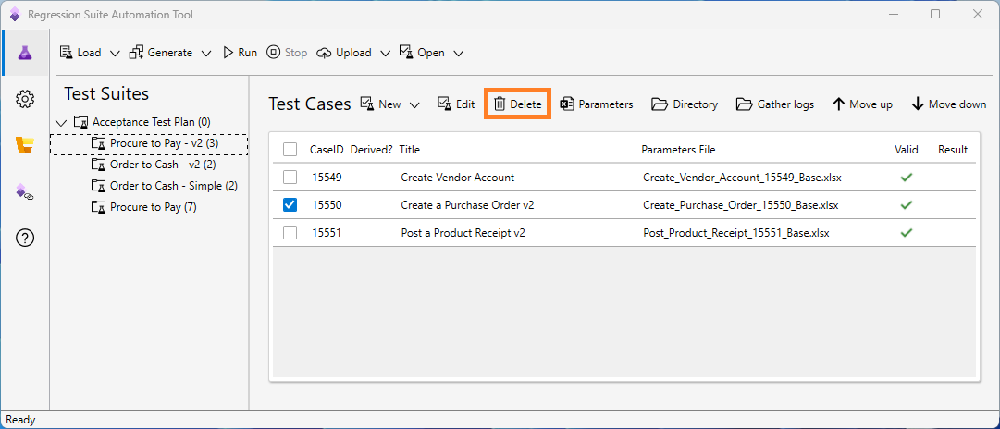
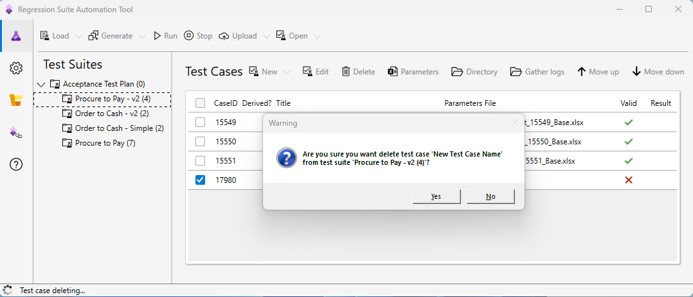

# Maintain test cases in Regression suite automation tool (RSAT)

[!include [banner](../../includes/banner.md)]

Regression suite automation tool (RSAT) lets you maintain test cases and attachments in the tool itself. In earlier versions, you had to use Microsoft Azure DevOps to maintain test cases and then switch to RSAT to run tests. Therefore, newer versions offer better usability and help improve productivity. Many operations can be done completely in RSAT, and it's also easier to work with test suites.

Test plans and test suites continue to be maintained in Azure DevOps.

To use this feature, you must enable the **Enable upload to Azure DevOps** option. Changes that are made in RSAT are then automatically uploaded to Azure DevOps and is available there. Therefore, test suites include the updated test cases that are available to other users or that can be run in Azure DevOps by a pipeline.

## View test case information

Follow these steps to view information about a test case.

1. In the **Test Cases** grid, find the relevant test case, and select this by checking the checkmark column, and then click the **Edit** action to open test case information.

    

2. This open the **Test Case information** dialog box.

    

The **Test Case information** dialog box shows the following information about the test case:

+ The name that is assigned to the test case in the test suite appears at the top of the dialog box and can be changed.
+ The recording name appears under the test case name. This name is taken from the recording XML file that was used when the recording was made in Task Recorder in the finance and operations app or by using the point of sale (POS) client.
+ The **Attachments** grid shows the list of attachment files that are available with the test case. You can also find this list by using the **Directory** action under the attachments subfolder.

## Create a test case that has attachments

Follow these steps to add a new test case by using RSAT.

1. Select the test suite that you want to add a new test case to (**Procure to Pay – v2** in this example). Then select **New** to open the **Test Case information** dialog box.

    

2. Enter the name of the test case, and add attachment files. These files include the recording XML file that contains steps for the test case. To add attachment files, select **Add**, and then, in the dialog box that appears, select the files to add as attachments.
3. When finished, select **Save** to save the new test case or **Cancel** to discard it.

    

When you save a new test case, RSAT copies the attachment files that you selected into your local RSAT working directory. It maintains the copies there so that they can be used with the test case.

There isn't a feature that automatically clones test cases from one test suite to another. However, but you can manually clone test cases by following these steps.

1. Create a test case as described in the previous procedure. As part of this step, add the recording XML file.
2. Save the new test case, and make a note of the **CaseID** value that is assigned to it.
3. You can add a parameter Excel file to the new test case. However, the file name must match the new **CaseID** value. Copy the parameter Excel file from the test case that you're cloning, and change the file name of the copy so that it matches the new **CaseID** value.
4. Open the new parameter Excel file, and change all instances of the old **CaseID** value to the new **CaseID** value.
5. After updating the new parameter Excel file, add it to the new test case as an attachment.

You can generate a parameter Excel file for the new test case first, and then manually edit it so that it matches the parameter Excel file of the test case that you're cloning.

## Remove an attachment from a test case

You can remove attachments from a test case when you no longer require them.

- In the **Test Case information** dialog box, select and hold (or right-click) the row for the attachment file, and then select **Remove**.

    

You can also use this procedure if you've edited the recording XML file and you want to upload the new version to the test case. In this case, you should first remove the existing file and then add the new file.

## Delete a test case

Follow these steps to delete a test case.

1. In the **Test Cases** grid, find the relevant test case, and select this by checking the checkmark column, and then click the **Delete** action to delete a test case.

   

2. This opens a dialog box to confirm that the test case should be deleted. Confirm by selecting **Yes** or cancel by **No**

    

A test case that you delete in RSAT is removed from the current test suite, both locally and in Azure DevOps.

In Azure DevOps, work items represent test cases, and test suites contain links to the test case work items. A test case is reused by linking to it from more than one test suite. When a test case is deleted in RSAT, RSAT determines whether the test case is linked to one test suite or more than one test suite. If the test case is used only by the current test suite, RSAT deletes the Azure DevOps work item that represents the test case. If the test case is used by other test suites, RSAT doesn't delete the work item itself. Instead, it deletes only the link to the work item.

[!INCLUDE[footer-include](../../../../includes/footer-banner.md)]

