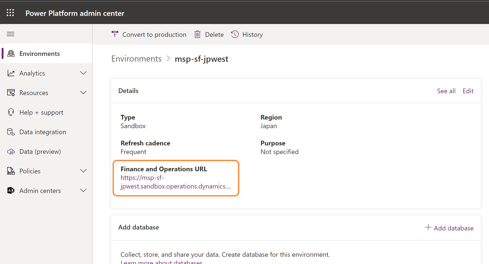
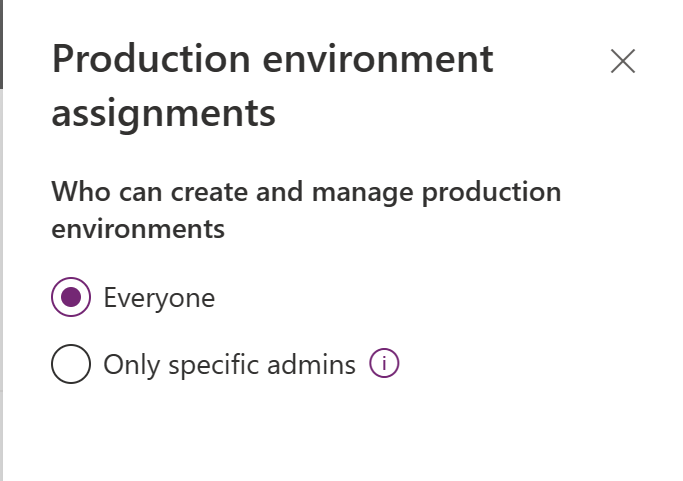
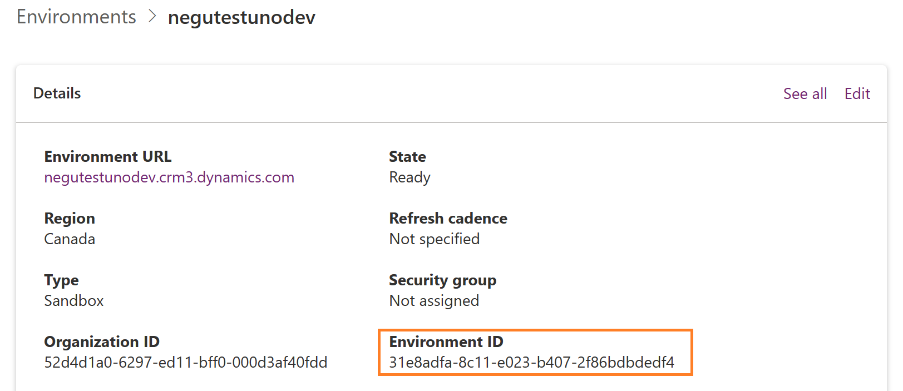

---
# required metadata

title: Enable Power Platform Integration
description: This article explains how to enable the Microsoft Power Platform integration by using Microsoft Dynamics Lifecycle Services (LCS) for finance and operations apps and Dataverse.
author: laswenka
ms.date: 02/07/2023
ms.topic: article
ms.prod:
ms.technology: 

# optional metadata

# ms.search.form:
audience: Developer, IT Pro
# ms.devlang: 
ms.reviewer: sericks
# ms.tgt_pltfrm: 
ms.custom: "intro-internal"
ms.search.region: Global
# ms.search.industry:
ms.author: laswenka
ms.search.validFrom: 2021-10-13
ms.dyn365.ops.version: 10.0.0
---
# Enable Power Platform Integration

[!include[banner](../includes/banner.md)]

As part of One Dynamics, One Platform effort, a growing number of customers are getting value out of integrating their Finance and Operations apps with Microsoft Dataverse and the Power Platform ecosystem.  From building low-code applications, to fully integrating front-office and back-office processes and applications, the integration of these two systems has become a common requirement for many customers.

Power Platform Integration is a feature enabled in Lifecycle Services (LCS) that allows an administrator to link their Finance and Operations environments with new or existing Power Platform based environments. 
Once Power Platform Integration is established, this enables your organization to:

* Create low-code apps and flows by using the Power Platform environment linked to Finance and Operations.
* Integrate finance and operations apps data with the Dataverse platform by using virtual tables, business events, and dual-write features.
* Install and connect other Dynamics 365 applications with your finance and operations apps.
* Install add-ins and connect them with your finance and operations apps.

To learn more about Power Platform Integration, you may also watch our TechTalk on the [Microsoft Dynamics 365 Community](https://www.youtube.com/watch?v=HmJIuHhx3Hg) YouTube channel.

> [!VIDEO https://www.youtube.com/embed/HmJIuHhx3Hg]

## Initial Power Platform environment

By default, all finance and operations apps environments (sandbox and production) that are managed by LCS will receive an initial Power Platform environment **without** Dataverse. This environment is linked to your finance and operations environment, as shown in the following illustration. The relationship is one to one. Over time, your finance and operations apps will be migrated to this location in Power Platform admin center. You can determine whether an environment in Power Platform admin center is linked to an environment from LCS by looking at the finance and operations apps URL on the environment details page in Power Platform admin center.



The Power Platform environment that is connected to your environment in LCS enables finance and operations apps customers to take advantage of Microsoft Power Platform. This Power Platform environment can't be deleted or reset, and a Dataverse database can't be manually added to it in Power Platform admin center. To add Dataverse and fully enable Microsoft Power Platform integration capabilities, follow the instructions in the [Enable integration with an existing Power Platform environment](#connect-to-existing-dataverse) section of this article.

Alternatively, your organization might already have a Power Platform environment with Dataverse that you want to connect to your finance and operations environment. To reuse an existing Dataverse instance, follow the instructions in [Enable integration with an existing Power Platform environment](#connect-to-existing-dataverse). In this case, the initial Power Platform environment that was created when your finance and operations environment was created is disconnected and will no longer show the finance and operations apps URL. At that point, the initial environment can be deleted or used for another purpose.

## Licensing and capacity considerations

When you purchase a license for any finance and operations app, such as Dynamics 365 Finance or Dynamics 365 Supply Chain Management, your tenant is entitled to an additional 10 gigabytes (GB) of Dataverse database capacity. In addition, for each user license that you purchased, you receive an incremental amount of database capacity, as shown in the following illustration from Power Portal admin center.


The same purchase of licenses entitles you to one self-service sandbox environment and production environment in LCS. Because of this, an initial Power Platform environment can automatically be created for every finance and operations apps environment. Every initial environment in Power Platform admin center is without Dataverse. Therefore, it uses only 1 GB of database capacity to provision apps that are created by using Power Apps and flows that are created by using Power Automate. When you set up Power Platform integration, a Dataverse database is added to the same environment. This database often consumes 3 GB or more.

Additional add-on sandbox environments that customers purchase to use in LCS do **not** entitle them to additional Dataverse database capacity. Customers who will require Power Platform integration capabilities should purchase add-on Dataverse database storage. For more information about how to manage capacity in Power Platform admin center, see [Free up storage space](/power-platform/admin/free-storage-space).

## Provisioning templates

In several of the scenarios that are described in this article, you can create a brand-new Power Platform environment with Dataverse. To help you quickly add all the applications that are required for your new instance, we have prepared several provisioning templates that bundle them together. The following table provides details about these templates.

| Template name | Description | Apps included |
|---------------|-------------|---------------|
| Dynamics 365 Standard | This basic template prepares all the platform components for business events, virtual tables, dual-write functionality, and add-in support. Dual-write isn't enabled and won't automatically sync data when this template is selected. Select this template if you don't require a more specific template. | MicrosoftOperationsVEAnchor, DualWriteCoreAnchor, MsDynCE_CRMHub, MsDyn_FnOIntegrationMDLApp_Anchor |
| Dynamics 365 Standard with dual-write | This template is the same as **Dynamics 365 Standard**, but it includes all the applications that are required for dual-write, so that you can quickly enable that feature after environment deployment. | MicrosoftOperationsVEAnchor, DualWriteCoreAnchor, MsDynCE_CRMHub, MsDyn_FnOIntegrationMDLApp_Anchor, MsDyn_DualWriteAppCoreAnchor |
| Project Operations | This template is specific to the Dynamics 365 Project Operations scenario. It's available only if your tenant has licenses and entitlement for Project Operations. | MicrosoftOperationsVEAnchor, Dynamics365FinanceAndOperationsAnchor, ProjectOperations_Anchor |

## Prerequisites for setting up the Microsoft Power Platform integration

The following list describes the prerequisites for setting up the Microsoft Power Platform integration.

- Make sure that at least 1 GB of Microsoft Power Platform database storage capacity space is available for your tenant. If this space isn't available, the setup will fail. View your capacity in the [Power Platform admin center](https://admin.powerplatform.microsoft.com/resources/capacity). 

- Validate the governance policy of your tenant in Power Platform admin center. To do this validation, you must have either the **Global administrator** role or the **Power Platform administrator** role.

    1. Sign in to the [Power Platform admin center](https://admin.powerplatform.microsoft.com).
    2. Select **Settings** in left navigation to open the **Power Platform settings** page.

        

- For organizations that **don't allow everyone** to create Microsoft Power Platform environments, the user performing the setup in Lifecycle Services must be added to one of the following roles in Azure Active Directory (Azure AD). To make this change, you must be assigned to the **Global administrator** role.

    - Dynamics 365 Service Admin
    - Power Platform Admin

-The user performing the setup in Lifecycle Services must be licensed. The Microsoft 365 admin center should be used to apply the **Dynamics 365 Unified Operations Plan** license, the **AX Enterprise** license, or an application-specific license such as **Dynamics 365 Finance**.

## <a name="enable-during-deploy"></a>Enable integration during environment deployment

> [!IMPORTANT]
>This experience is now deprecated, and will soon be disabled during the creation of new Sandbox or Production environments in Lifecycle Services.  The recommended action is to perform the Power Platform Integration setup after the Finance and Operations apps environment is deployed.
>
> Power Platform integration is **irreversible**, and the link can't be changed or removed. As part of the setup, you connect your finance and operations environment to a Power Platform environment. Runtime features such as virtual entities, business events, and dual-write all depend on this connection. Therefore, it can't be removed until you delete the finance and operations environment. This behavior resembles the behavior when you apply a service update from Microsoft. The only way to redo this action is to redeploy the environment.

## <a name="enable-after-deploy"></a>Enable integration after environment deployment

Performing the setup for Power Platform Integration should be done after the Finance and Operations apps environment is created and finished deploying.  From the environment details page, you may choose to connect your environment in LCS to either a new or an existing Power Platform environment.

> [!IMPORTANT]
> Power Platform integration is **irreversible**, and the link can't be changed or removed. As part of the setup, you connect your finance and operations environment to a Power Platform environment. Runtime features such as virtual entities, business events, and dual-write all depend on this connection. Therefore, it can't be removed until you delete the finance and operations environment. This behavior resembles the behavior when you apply a service update from Microsoft. The only way to redo this action is to redeploy the environment.

1. After the finance and operations apps environment has been deployed through LCS, open the **Environment details** page in LCS.
2. In the **Power Platform integration** section, select **Setup**. *If you want to connect to an existing Dataverse organization, see the next section of this article.*

     

3. In the **Power Platform environment setup** dialog box, agree to the terms and conditions, and then select **Setup**.

    > [!NOTE]
    > Based on the template chosen, a related Dataverse database will be added to your Initial Power Platform environment.  The language and currency values in Dataverse will be defaulted based on your Azure Active Directory tenant’s physical address.  For example, if your physical address is in Seattle, Washington your language will default to ‘en-us’ and your currency will default to ‘USD’.  If you wish to use values other than these, you may create your Power Platform environment manually in the Power Platform admin center and then follow the instructions to link to an existing Power Platform environment.

4. When you receive a message that states that the Microsoft Power Platform environment is being provisioned, select **OK**.

    The **Power Platform integration** section of the **Environment details** page now shows a message that states that the Microsoft Power Platform environment is being provisioned.

5. After a few minutes, refresh the **Environment details** page.
6. In the **Power Platform integration** section, notice that the value of the **Status** field is **Environment setup is in progress**.

    Typically, the setup takes between 60 and 90 minutes.

    After the Dataverse instance is provisioned, the **Install a new add-in** and **Dual-write application** buttons become available in the **Power Platform integration** section.

    

    

After you complete the setup, the only way to reverse the action is to delete the environment in LCS. Relinking or linking to another environment isn't supported.

### <a name="connect-to-existing-dataverse"></a>Enable integration with an existing Power Platform environment

If you already have a Dataverse instance that you want to connect to a finance and operations environment, you can choose this option during the Power Platform Integration setup. 


To retrieve the Power Platform environment ID, you may do so by visiting that environment details page in the Power Platform admin center.



During the integration process, Microsoft will apply the packages for the **Dynamics 365 standard** provisioning template. If you require packages from the other templates, you must manually install. For more information, see the [Provisioning templates](#provisioning-templates) section of this article.

Customers who are already live with Power Platform environments or other Dynamics 365 apps, and who want to add finance and operations apps to that ecosystem, will find it most useful to bring their existing Dataverse instance. For the integration, you use the same setup process that is described earlier for a new Dataverse database in the initial environment. After you complete the integration setup, the only way to reverse the action is to delete the environment in LCS. Relinking or linking to another environment is not supported.

#### Validations for bringing your existing Power Platform environment

If you connect an existing Power Platform environment, the following validations must pass. Otherwise, the request won't proceed.

1. The **Enable D365 apps** option must be enabled when Dataverse is deployed in the Power Platform environment. This type of Dataverse deployment is the only type that supports Dynamics 365 apps, including connections to finance and operations apps.
2. The Power Platform environment must be in the same geography as finance and operations apps. For example, in LCS, you might see an Azure Region such as **West US 2**. In Microsoft Power Platform, the environment should be deployed in **United States**. This requirement is in place for performance and data residency reasons.
3. The user in LCS who is doing the Power Platform integration setup must be an administrator of the environment in Dataverse, and must have an applicable Finance, Supply Chain Management, or Commerce license assigned.  Note that if the System Administrator role was just assigned, it can take up to an hour for the cache to refresh and before you can perform the setup via LCS.

### Environments that already use dual-write, virtual tables, business events, or add-ins before Power Platform integration is enabled

For customers who enabled dual-write, virtual tables, or business events before the Power Platform integration feature existed, we are in the process of automatically creating Dataverse where it's missing in LCS.

You can verify that the Microsoft Power Platform integration was automatically enabled by viewing the **Power Platform Integration** section of the **Environment details** page for the finance and operations apps environment in LCS. If the integration was successfully enabled, the **Environment name** field will show the name of the integrated Microsoft Power Platform environment, and the **Status** field will be set to **Setup completed successfully**.

## Troubleshooting the setup

Setup can fail at various stages of the deployment of the Dataverse-based environment.

Any time that the setup fails, an error message is shown. The following illustration shows an example of the error message for a dual-write setup failure.


Based on the error message, you might have to address licensing or capacity issues. After these issues have been fixed, you can select **Resume** in the **Power Platform integration** section of the **Environment details** page in LCS to finish the setup.

## Enable the integration for cloud-hosted development environments

Due to the architecture differences between cloud-hosted development environments and the Sandbox or Production environments, setting up Power Platform Integration is not possible after the developer environment is created.  This means that the only way to setup Power Platform Integration is during the deployment of your cloud-hosted environment.  This also means that it is only possible to connect a new cloud-hosted environment with a new Power Platform environment, you cannot connect an existing environment of any kind via Lifecycle Services.


## Verifying Power Platform integration status at runtime

The ```RetrieveFinanceAndOperationsIntegrationDetails``` API is available in Dataverse to validate the status of the Power Platform integration for the Power Platform environment. If the Power Platform environment is linked to a finance and operations apps environment through the Power Platform integration, the API will return the AAD tenant and environment details of the finance and operations apps environment.

The API can be used in troubleshooting to verify that the Power Platform integration is enabled for an environment. It is also recommended that the API be used in coding plug-ins, client forms, or other applications that must be aware of the finance and operations apps environment linked to the Power Platform environment.

**Request**
```http
GET [Organization URI]/api/data/v9.1/RetrieveFinanceAndOperationsIntegrationDetails
```

**Response**
```json
{
    "Url": "https://contoso.operations.dynamics.com",
    "TenantId": "72ad15fq-3m88-4e15-be25-8751c9bd0764",
    "Id": "b2106f5c-e218-4aac-841a-a59da4738eb4"
}
```

**Properties**

| Property<br>**Physical name**<br>***Type*** | Use | Description |
| --- | --- | --- |
| Environment URL<br>**Url**<br>***String*** | Read-only<br>Required | The URL of the finance and operations apps environment linked to the Power Platform environment through the Power Platform integration. |
| Tenant ID<br>**TenantId**<br>***GUID*** | Read-only<br>Required | The ID of the Azure AD tenant on which both the finance and operations apps environment and Power Platform environment are located. |
| Environment ID<br>**Id**<br>***GUID*** | Read-only<br>Required | The ID of the finance and operations apps environment linked to the Power Platform environment through the Power Platform integration. |

If the environment is not linked to a finance and operations apps environment through the Power Platform integration, the following error is returned in the API response:

| Error code | Message |
| --- | --- |
| 0x80048d0b | Dataverse instance is not integrated with finance and operations. |

[!INCLUDE[footer-include](../../../includes/footer-banner.md)]

