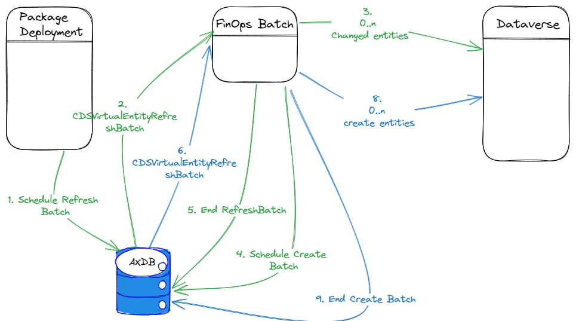

# Create and refresh virtual entities automatically

[!include[banner](../includes/banner.md)]

This article helps you learn about about automatically creating and refreshing virtual entities for finance and operations apps to Dataverse.

> [!IMPORTANT]
> Supported Release Information
>
> - **Auto Refresh :** Supported platform versions - PU62 (7.0.7120.170) or PU63 (7.0.7198.123) or PU64 (7.0.7279.31) or later. 
> - **Auto Create :** Supported platform versions - PU63 (7.0.7198.123) or PU64 (7.0.7279.31) or later.

Changes made in Finance and Operations apps on Data entity are visible to Dataverse through a manual refresh in Dataverse. The Auto Create and Refresh capability in Finance and Operations enables automatic metadata creation or modification in Dataverse immediately, reliably and efficiently. Automatic refresh of metadata ensures timely updates in Dataverse from finance and operations apps. Enabling Automatic Create and Refresh capability eliminates the need to manually refresh finance and operations entity into Dataverse. This capability paves way for automatically creating virtual tables in Dataverse for Finance and Operations apps data entities.

**Auto Refresh:**
* Virtual Table Auto Refresh feature is activated when the supported version of package is deployed. Supported platform versions are - PU62 (7.0.7120.170) or PU63 (7.0.7198.123) or PU64 (7.0.7279.31) or later.
* The package when deployed in Finance and Operation apps, triggers an X++ batch job (CDSVirtualEntityRefreshBatch). This batch job is triggered 30 minutes after successful deployment of feature package.

**Auto Create:**
* Auto create capability is activated when the supported version of the feature is deployed. Supported platform versions - PU63 (7.0.7198.123) or PU64 (7.0.7279.31) or later.
* In Microsoft Dynamics 365 Finance and Operations, the user has to set "Dataverse.AutoCreate" metadata property value to "Yes" to enable automatic creation of Virtual Table in the linked Dataverse environment.
* The automatic virtual table creation in Dataverse from finance and operations apps is managed through a batch job (CDSVirtualEntityAutoCreateBatch). This batch is triggered 90 minutes after successful deployment of feature package.

**Failure** due to automatic create or automatic refresh batch job is addressed through an automatic retry process. Auto create and Auto refresh batch jobs are set to retry three times after a failure. The retry setting is fixed and can't be modified or configured. 

## Monitoring

* The status of the auto create or auto refresh batch jobs can be monitored using the existing Batch Jobs form.
* Additionally, the status of Automatic Metadata Synchronizations can be checked using a newly created form.
* To view the results of automatic metadata synchronizations, navigate to the new Finance and Operations form named "Virtual entity metadata sync status"
* All automatically created and refreshed finance and operations entities are displayed within this form.
  * In case of successful synchronization, the "Last refresh time" field indicates the time of the successful synchronization.
  * In case of a failed synchronization:
    * Personalize the grid within this form by adding the "IsTransientFailure" field for enhanced visibility and troubleshooting.
    * The "Failure message" field provides details about the error.
    * The "IsTransientFailure" field indicates whether the failure is transient and if a retry is attempted.
    * For entities marked as failed with Refresh Needed unchecked, manual refreshing from Dataverse is required after resolving the issue. Please note that this action must be taken by the user as the system doesn't automatically address these issues.  You can refer to [Web service error codes](/power-apps/developer/data-platform/reference/web-service-error-codes) for understanding any error codes in the failure message.

## Notes
* **Refresh Batch Job History Limitation:** With each package deployment, the Refresh batch job is recreated, limiting the availability of refresh job history to the last package deployment only. This behavior persists in the current version. Microsoft is aware of this limitation and plan to address it in future releases.
* **Auto Delete Feature:** Please note that there currently isn't an Auto Delete feature implemented. If a Finance and Operations apps Data Entity that is already enabled in the linked Dataverse environment is deleted, no action is taken automatically. Administrators are required to manually delete the Virtual Table in Dataverse.
