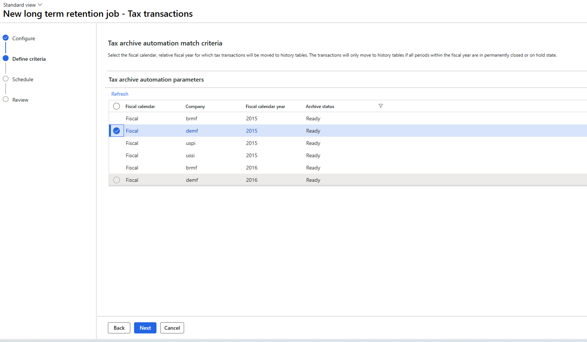
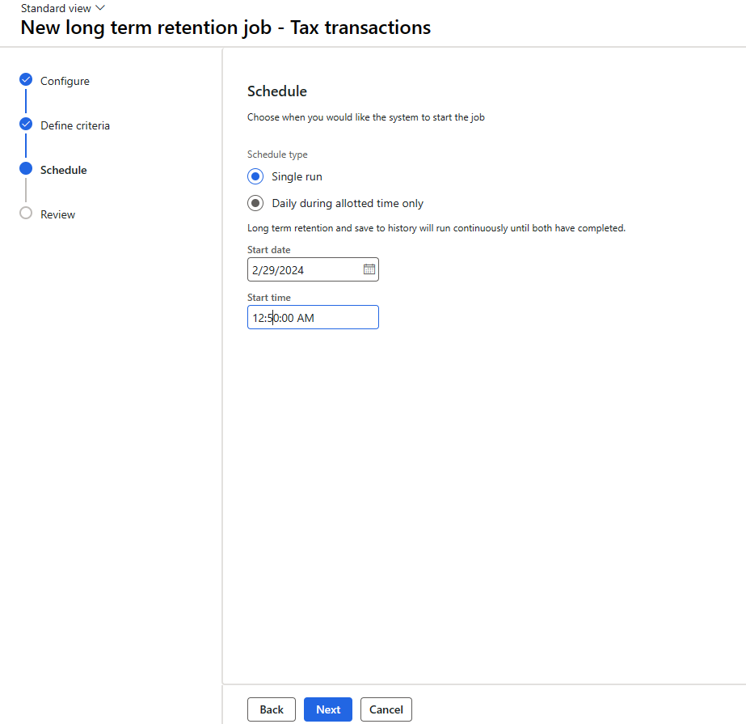

# Archive data in Dynamics 365 Finance Tax transactions (preview)

[!INCLUDE [preview-banner](../../../supply-chain/includes/preview-banner.md)]

This article explains how to archive data in Microsoft Dynamics 365 Finance Tax transactions.
When you archive tax transactions, data from the following tables will be moved to history tables:
- TaxTrans
- TaxTrans_BR
- TaxTrans_IN
- TaxTrans_IT
- TaxTrans_RU
- TaxTrans_W
- TaxTransExtensionTH
- TaxTransGeneralJournalAccountEntry
- TaxTransSubledgerJournalAccountEntry
- TaxTrans_Reporting

## Prerequisites

Make sure your environment is confugured to utilize archive feature. For details, see [Set up and manage archive data](archive-setup-manage.md).
In addition, the following prerequisites must be met before you archive Tax transactions:
- No periods for a fiscal year and the company can be open.
- Year-end close must be run for the fiscal year for the company.
- Tax transactions for the previous fiscal year for the company must be archived.

> [!NOTE]
> Tax archive utilizes the same conditions of data readiness for archiving as for [General ledger data](archive-gl.md):
> - Tax transactions archiving can occur only for fiscal years that the year-end close process has been run for.
> - The archive jobs for different years must be run in chronological order. For example, 2020 Tax transactions data must be archived before 2021 Tax transactions data.

## Set up an archival job

To set up an archival job, follow these steps.

1. Go to **System administration** \> **Archive with Dataverse long term retention** to open the **Archive with Dataverse long term retention** workspace.
2. Select **Tax transactions functional scenario**.

3. Select **Refresh** to populate the fiscal years and company dataset to archive.

    > [!NOTE]
    > Run the refresh after you do period and year-end close on the Tax transactions data for the fiscal years and the companies. The **Ready to archive** state must be **Ready** before you can schedule a new long term retention job.

4. Select **New long term retention** to open a wizard that you can use to schedule a new Tax transactions long term retention job.

   
5. Enter a name for the job, and then select **Next**.

    New long term retention jobs can be scheduled for one or more companies at a time. Execution of these jobs is sequential.

6. On the **Define criteria** page, select the combination of fiscal years and companies to archive Tax transactions data for.

  
7. Select **Next**.
8. Select the type of scheduling.

  
  Two types are supported:

    - **Single run** – long term retention and saving to history run continuously until both processes are completed. Data is always archived in Dataverse long term retention first. Then the save to history tables occurs.
    - **Daily during allotted time** – The long term retention runs continuously until it's completed. The **Save to history** process runs only during the specified start and stop archiving time.

9. Select **Finish** to schedule the archive job for the selected fiscal years and the companies.

10. Select **View progress** to view the detailed logs.

## View historical data from the history table

To view the historical transactional details, follow this step.

- Go to **Tax** \> **Inquiries and reports** \> **Voucher transactions history**.
