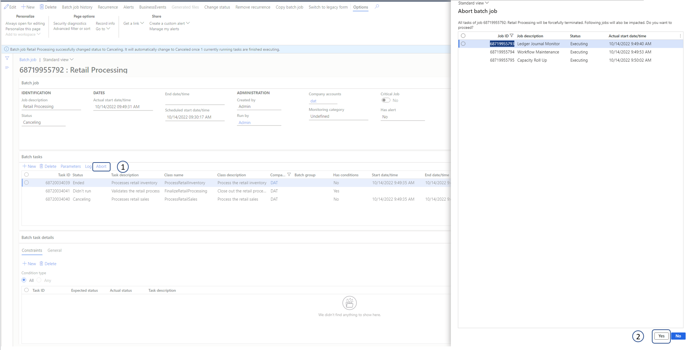

---
# required metadata

title: Cancel a running batch job
description: This article explains how to cancel a batch job that is running.
author: karimelazzouni
ms.date: 11/17/2023
ms.topic: article
ms.prod: 
ms.technology: 

# optional metadata

# ms.search.form: 
# ROBOTS: 
audience: IT Pro
# ms.devlang: 
ms.reviewer: johnmichalak
# ms.tgt_pltfrm: 
ms.assetid: 6135bcf7-bf8f-42ae-b2c6-458f6538e6a4
ms.search.region: Global
# ms.search.industry: 
ms.author: sopat
ms.search.validFrom: 2019-05-08
ms.dyn365.ops.version: Platform update 27

---

# Cancel a running batch job

[!include [banner](../includes/banner.md)]

## Cancel a batch job

> [!NOTE]
> System jobs can't be moved to **Canceling** status.

If you must cancel a batch job that is running, you can change its status to **Canceling**. The batch job is then prevented from picking up new tasks. The status of tasks in the batch job that hasn't started is set to **Didn't run**, and the status of tasks that have been started is set to **Canceling**. The status of a task isn't changed until that task can be terminated gracefully (that is, either it completes or it errors out).

To cancel a running batch job, follow these steps.

1. On the **Batch job** page, on the Action Pane, select **Change status**.
1. In the **Select new status** dialog box, under **Select new status**, select **Canceling**.
1. Select **OK**.

The following illustration shows an example of a batch job and its tasks after batch job is canceled.

## Abort the tasks in a batch job

Sometimes, the tasks in a batch job can't be terminated gracefully. Therefore, the status of the batch job remains **Canceling** for long time while the system waits for the graceful termination. In these cases, the system administrator or batch job manager can abort all the tasks that are in **Canceling** status for a batch job. The **Abort** command forces the tasks in the batch job to immediately cease execution.

> [!IMPORTANT]
> - The action of aborting a running process is inherently unsafe, and therefore should be used with caution. It can cause data corruption that can, in turn, cause either orphaned or incomplete data. This action should be used only to mitigate other issues that are caused by the running tasks.
> - This action can't stop the execution of tasks that are stuck in an unmanaged wait. Examples include tasks that are stuck because of SQL deadlocks or DIXF-related tasks. In such cases, tasks will be aborted after they are no longer in an unmanaged wait.

To abort all the tasks that are in **Canceling** status for a batch job, follow these steps.

1. On the **Batch job** page, on the **Batch tasks** FastTab, select **Abort**.
1. A message box prompts you to confirm that you want to abort all running tasks for the batch job. Select **Yes**.

### Enhanced batch abort feature

> [!IMPORTANT]
> - In release 10.0.31, a drain period has been added. The appropriate batch servers won't pick up new tasks for a maximum of 15 minutes after the **Enhanced batch abort** feature is used. This drain period gives other tasks that are in an **Executing** state on the batch servers time to be completed correctly. When either no more tasks in an **Executing** state remain on those servers or 15 minutes have passed, the batch servers are restarted.
> - This feature is enabled by default starting 10.0.38 (PU 62).
> - This feature is mandatory starting 10.0.39 (PU 63).

To use the **Enhanced batch abort** feature, you must enable it in the [Feature management](../../fin-ops/get-started/feature-management/feature-management-overview.md) workspace. After this feature is enabled, the **Abort** command will restart all the batch servers that are currently running tasks of the batch job that you're trying to abort. Other tasks might also be running on those servers. Those tasks are interrupted when the servers are restarted.

Because the servers are restarted, the **Enhanced batch abort** feature makes the functionality more resilient to the limitations of the **Abort** command. It also ensures that the tasks of the batch job that you're trying to cancel are truly interrupted.

To abort all the tasks that are in **Canceling** status for a batch job when the **Enhanced batch abort** feature is enabled, follow these steps.

1. On the **Batch job** page, on the **Batch tasks** FastTab, select **Abort**.
2. The **Abort batch job** dialog box lists other batch jobs that might be disrupted if you continue. To confirm that you want to continue, select **Yes**.

If you don't want to cancel other running batch tasks on the batch servers, and you prefer the old behavior where only the tasks of the batch job are canceled instead of all running jobs, you can disable the **Enhanced batch abort** feature in the **Feature management** workspace. Then try to [abort a batch job](#abort-the-tasks-in-a-batch-job) again.

[!INCLUDE[footer-include](../../../includes/footer-banner.md)]
