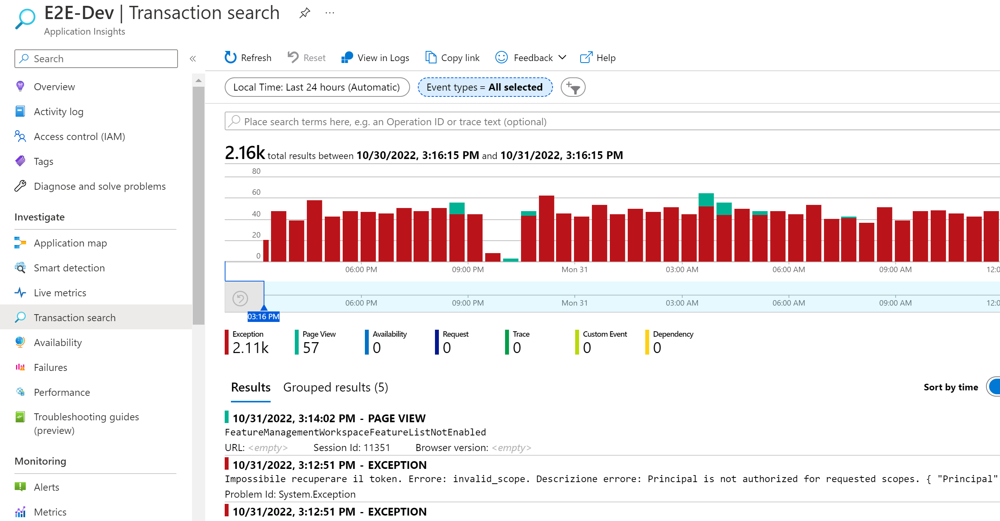
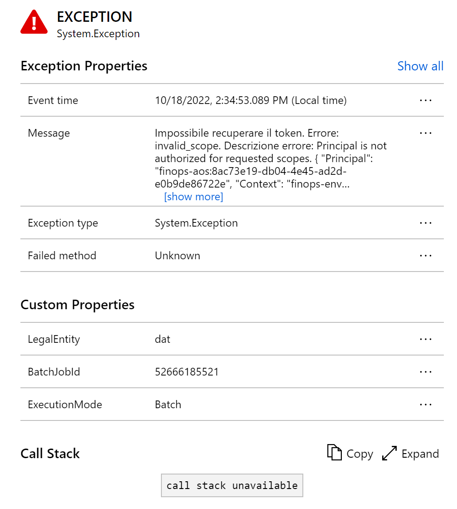

---
# required metadata

title: Monitoring and telemetry using Application Insights
description: This article explains how to use, setup, and configure the Azure Application Insights integration for Finance and Operations apps.
author: LaneSwenka
ms.date: 10/19/2022
ms.topic: article
ms.prod:
ms.technology:

# optional metadata

# ms.search.form:
# ROBOTS:
audience: IT Pro, Developer
# ms.devlang:
ms.reviewer: twheeloc
# ms.tgt_pltfrm:
ms.custom: 257614
ms.assetid: 558598db-937e-4bfe-80c7-a861be021db1
ms.search.region: Global
# ms.search.industry:
ms.author: laswenka
ms.search.validFrom: 2016-09-30
ms.dyn365.ops.version: AX 7.0.0

---

# Monitoring and telemetry using Application insights

The monitoring and telemetry feature in finance and operations apps is a point-to-point integration directly between an instance of finance and operations to the target Application insights destination. The telemetry generated isn't collected by Microsoft for support or other operational reporting, the data is customer owned and customer driven. This feature allows developers and admins to triage and resolve application issues in near-real time. 

## What telemetry and which tables are being populated in Application insights?

The following table describes the different telemetry types coming from X++ and the target table name in Application insights.

|Telemetry type |	Application Insights table name |
|------------|---------------------------------|
|FormRun form loads |	pageViews |
|X++ Exceptions |	Exceptions |
|X++ custom events |	customEvents |
|X++ custom metrics |	customMetrics |

Application Insights has a wide range of features to help you use this data:
* [Create a dashboard](/azure/azure-monitor/visualize/tutorial-logs-dashboards) for an overview of the health of your org.
* Perform proactive monitoring by using [Smart detection](/azure/azure-monitor/app/proactive-diagnostics).
* [Set up alerts](/azure/azure-monitor/app/tutorial-alert) for important scenarios based on your org.
* Visualize and track common navigation [patterns from a usage](/azure/azure-monitor/app/usage-flows) perspective. For example, if a user always selects a specific tab first before navigating back to the main tab and closing the page. This might indicate that a field should be positioned on the first tab to save the user time.
* Create custom queries to troubleshoot performance and errors by using the [Logs](/azure/azure-monitor/log-query/log-query-overview) panel under **Monitoring** on the left pane.

## Overview panel in Application insights

Application insights provides different views of the telemetry data it has collected. The **Transaction search** panel shows a detailed list of the various diagnostics and events from your finance and operations app and is a gateway to the other features of the portal. You can drill into each entry for more details. See the following sample.

The list can be filtered to the telemetry types of your choosing, and these views can be saved on to Azure dashboards.
 
## Performance panel in Application insights

The performance panel isn't used by this feature today, but may be populated in the future.

## Failures panel in Application insights

To open the **Failures** panel, select either **Failures under investigate** on the left pane or select the **Failed requests** graph.
 
The exceptions table in Application insights powers the **Failures** panel. All exceptions captured in X++ show up as generic System.Exception type exceptions. The count of failed requests and the number of users affected for each operation for the application are shown on this panel. You can see error details for the operations if you click them. Failures related to standard business logic, X++ customizations, and ISV solutions are captured here. This includes errors generated by interactive user activity in the browser, and batch jobs processing data asynchronously on a batch AOS. Selecting an operation shows more information about it in the right panel.
 
In the telemetry properties, you can identify if a failure originated in **Interactive** or **Batch**, by which user, and from which legal entity. The exception can also be logged as a bug in Azure DevOps or GitHub using standard integrations from Azure Application Insights. Exceptions can also be logged to a bug in your bug tracking system of choice.

More information: [Find and diagnose run-time exceptions with Azure Application Insights](/azure/azure-monitor/learn/tutorial-runtime-exceptions)

## Querying data in Application insights
In **Application insights**, go to the **Logs** panel under **Monitoring** on the left pane.
 
### Common fields

All the telemetry and events populated in Application insights have these common fields:
 - **cloud_RoleInstance**: This will be populated with the instance type such as **ServiceFabric** for **Sandbox** and **Production**, or a cloud hosted environment name for a VM-based deployment.
 - **session_Id**: This uniquely identifies all activities in a single user session. The session value is reset when a user opens a new tab, selects F5/refresh, or closes and reopens the app.

>[!NOTE] 
>This is only enabled if User sessions telemetry is configured.

 - **user_Id**: This is currently set to user ID from the UserInfo table of finance and operations. 
 
>[!NOTE] 
>This is only enabled if User sessions telemetry is configured.

 - **client_IP**: This field is always populated to 0.0.0.0 by Application insights for General Data Protection Regulation (GDPR) compliance. The IP address provided is used to populate the **client_City**, **client_StateOrProvince**, and **client_CountryOrRegion** fields.
 - **message**: This field is used to capture the error message shown to the user, in their local language, and the X++ stacktrace that originated in the error for failure type telemetry.
 - **Custom properties – LegalEntity**: This is populated with the legal entity code that originated in the telemetry.
 - **Custom properties – BatchJobId**: This is populated with the record-id of the batch job that resulted in the telemetry.
 - **Custom properties – ExecutionMode**: This is populated with **Interactive** for browser-initiated telemetry, and **Batch** for batch jobs. If set to **Batch**, an accompanying BatchJobId will be populated.

## How to enable the public preview feature

> [!Note]
> This feature isn't available in Azure China or Azure Government at this time. We will work to add this to the generally available feature when it comes available.  Currently, all of the telemetry is sent **only** to Azure public cloud, so you won't be able to supply an instrumentation key for China or Government at this time.

This feature is in public preview and is first enabled by going to the **Feature management** workspace. Search for **Monitoring and telemetry** and enable it. If you don't see this option, and the private preview feature enabled, you'll need to disable that first. For more information, see the next section of this article.

Once enabled, you will need to configure the parameters.
1.	Go to **System Administration > Setup > Monitoring and telemetry parameters** page.
2. On the **Environments** tab, fill in the LCS Environment IDs for each environment, and categorize the environment as a **Development**, **Test**, or **Production** environment. The **Environment ID** can be retrieved from the **Environment details** page in Lifecycle Services.
3.	On the **Application Insights Registry** tab, determine which categories of environments send telemetry to which specific application insights destination. For example, developer telemetry can go to one place, while Production telemetry can go to another.
4.	On the top tab called **Configure**, you can turn on and off each type of telemetry you wish to capture. You can keep them all enabled, or only enable them when you need to diagnose an issue. 

> [!Note]
> If you disable the telemetry, there's a cache and it'll take a few minutes to stop sending. In addition, if it's disabled, you won’t receive proactive alerts if you've enabled those in Application insights. If the telemetry is enabled, you'll have usage and potential extra costs with Application insights.

## How to disable the private preview feature

If the private preview software is installed, it must be removed from your environment through Lifecycle Services. This can be bundled in to your next regularly scheduled package deployment, by following the steps outlined in [Uninstall a package](/dynamics365/fin-ops-core/dev-itpro/deployment/uninstall-deployable-package).  

Once it's removed, you'll see the **Monitoring and telemetry** feature in the **Feature management** workspace. Once re-enabled, none of setup or configurations were changed as the schema names are identical in the public preview, so no data is lost by removing the private preview version.

[!include [banner](../includes/banner.md)]
