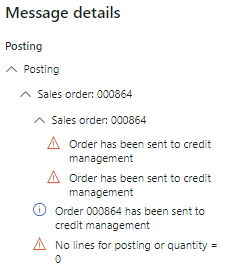

---
# required metadata

title: Credit limit holds FAQ
description: This article answers some frequently asked questions about credit checks, credit holds and the warning and error messages used in Credit management. 
author: JodiChristiansen
ms.date: 11/29/2023
ms.topic: article
ms.prod: 
ms.technology: 

# optional metadata

ms.search.form:  
# ROBOTS: 
audience: Application User
# ms.devlang: 
ms.reviewer: twheeloc
ms.search.scope: Core, Operations
# ms.tgt_pltfrm: 
ms.custom: 539093
ms.search.region: Global
# ms.search.industry: 
ms.author: jchrist
ms.search.validFrom: 2023-11-29
ms.dyn365.ops.version: 10.0.35

---
# Credit holds FAQ

This article answers some frequently asked questions about the credit check, credit holds, and the warning/error messages when using Credit management. 

The **Credit and collections parameters** page is found under **Credit and collections > Setup > Credit and collections parameters**. The **Blocking rules** are set up under **Credit and collections > Setup > Credit management setup > Blocking rules**. 

### After upgrading to version 10.0.35 or above, the credit check isn't working when it was working before upgrading

Blocking rules and credit management checkpoints are required to check the customer credit limit on a sales order. In versions 10.0.34 and before, there was a bug that allowed the credit check to work even when the blocking rule(s) weren't set up. This is fixed in versions 10.0.35 and later. Confirm that a blocking rule is set up for the credit limit used (or another blocking rule) and that the credit management checkpoint(s) are selected in **Credit and collections parameters**. For more information about block rules, see [Credit holds for sales orders](cm-sales-order-credit-holds.md). 

### I'm getting a warning or error message on the sales order. But the sales order isn't on a credit hold and I can't see it in the Credit management hold list 

If you see the below warning message in yellow or the error message in red, these are messages from prior credit functionality. The error or warning message is from the **Message when exceeding credit limit** in **Credit and collections parameters** > **Credit** tab > **Credit limits** FastTab. This error message is because the **Check credit limit on sales order** option is set to **Yes**. This means we want the credit limit checked on sales orders. The warning/error message can't be suppressed because they're the same messages that are used with Free text invoices. These messages appear if Credit management is enabled or disabled. When Credit management is enabled, they can be ignored. 

### If the warning/error message isn't used then how can I tell if a sales order went into a credit hold?

When a sales order is sent to the **Credit management hold list**, you see a posting message in **Message details** like below. It will be displayed in the **Credit management hold list** under **Credit and collections > Credit management hold list > All credit holds** or **Open credit holds**. 

### I set up a customer with a credit limit of 0.00 USD. Does this mean the customer has unlimited credit? 

When Credit management is enabled in Feature management, the credit limit of 0.00 means the customer has no credit. Set the **Unlimited credit limit** to **Yes** if the customer should have unlimited credit. This option is on the **Credit and collections** FastTab on the customer record. If Credit management is disabled, then a credit limit of 0.00 USD does mean unlimited credit. This is the "old" credit functionality. 

### I have credit management groups setup, but the sales orders are still not blocked based on the credit limit. 

Sales orders are blocked if there are credit management blocking rules and checkpoints setup, even when using customer credit groups. For more information about how credit is calculated when using credit limit groups, see [Credit limit scenarios](credit-limit-scenarios.md). 

