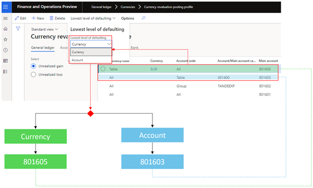

---
# required metadata

title: Currency revaluation posting profiles
description: This article describes the Currency revaluation posting profiles.
author: moaamer
ms.date: 01/10/2023
ms.topic: article
ms.prod: 
ms.technology: 

# optional metadata

ms.search.form: LedgerClosingSheet
# ROBOTS: 
audience: Application User
# ms.devlang: 
ms.reviewer: twheeloc
# ms.tgt_pltfrm: 
ms.custom: 14091
ms.assetid: c64eed1d-df17-448e-8bb6-d94d63b14607
ms.search.region: Global
# ms.search.industry: 
ms.author: moaamer
ms.search.validFrom: 2022-11-28
ms.dyn365.ops.version: AX 10.0.0

---

# Currency revaluation posting profiles

The currency revaluation posting profile allows you post currency revaluation adjustment to different accounts per module (General ledger, Accounts payable, Accounts 
receivable and Bank). It also gives you the ability to configure the posting to lower granular level on each module where you can define currency revaluation posting 
account per currency code and to the lowest level of ledger account, vendor, customer and bank. The differentiation could be for unrealized gain or loss for all modules, the realized gain or loss only available for accounts payable and accounts receivable.  

To create a new currency posting profile, go to **General ledger > Currencies > Currency revaluation posting profile**.  Select a Gain or Loss posting.

In the **Currency code** field, select All currencies or define specific currency by selecting **Table** in the currency code. In the **Account code** field, you can select **All**, **Group** or **Table** to identify account or main account depending on the module page selected. The **Main account** is a mandatory field where you select the currency revaluation posting account that will be used during the currency revaluation adjustment. 

As an example, the Unrealized gain for General ledger post the currency revaluation of EUR transactions on main account 600120 to adjustment account 801602. To post 
currency revaluation of all currencies on accounts that belongs to Travel and Expense (TANDEEXP) main category to adjustment account 801601. To post currency 
revaluation of all currencies on all accounts to adjustment account 801600.

**Table** – The posting profile applies to a specified ledger account. 
**Group** – The posting profile applies to the selected main account category. 
**All** – The posting profile applies to all main accounts that have the **Foreign currency revaluation** option set to **Yes**. 

## Accounts payable
As an example, the Unrealized gain for Accounts payable post the currency revaluation of EUR transactions on main account 1001 to adjustment account 801602. To post currency revaluation of all currencies on vendors that belongs to Parts vendors (10) vendor group to adjustment account 801601. To post currency revaluation of all currencies on all vendors to adjustment account 801600.

**Table** – The posting profile applies to a single vendor. 
**Group** – The posting profile applies to a vendor group. 
**All** – The posting profile applies to all vendors. 

## Accounts receivable
As an example, the Unrealized gain for Accounts receivable post the currency revaluation of EUR transactions on customer account US-001 to adjustment account 801602. To post currency revaluation of all currencies on accounts that belongs to Wholesales customers (10) customer group to adjustment account 801601. To post currency revaluation of all currencies on all customers to adjustment account 801600.

**Table** – The posting profile applies to a single customer. 
**Group** – The posting profile applies to a customer group. 
**All** – The posting profile applies to all customers. 

## Bank         
As an example, the Unrealized gain for Bank post the currency revaluation of EUR transactions on bank account USMF EUR to adjustment account 801602. To post currency revaluation of all currencies on accounts that belongs to BankEUR bank group to adjustment account 801601. To post currency revaluation of all currencies on all bank accounts to adjustment account 801600.

**Table** – The posting profile applies to a single Bank ID. 
**Group** – The posting profile applies to a bank group. 
**All** – The posting profile applies to all banks. 

The Lowest level of defaulting option allows the currency revaluation posting profile to determine the lowest level of the posting in the case of overlapped setting. 

Assumes there is a setup on the currency revaluation posting profile for unrealized gain under general ledger that have potential overlapped setting. Post currency revaluation adjustment of EUR currency for all accounts to account 801605. Post currency revaluation adjustment of all currencies for account 601400 to account 801603. 
Based on the Lowest level of defaulting setting the system will determine which account to take priority. 
-	Currency: will give priority to the currency and will post currency revaluation to 801605 account 
-	Account: will give priority to the account and will post currency revaluation to 801603 account

Note: The currency revaluation posting profile will only take place in the case of it has configured records. In the case of you did not configure the currency revaluation posting profile the system will use the defined accounts for currency revaluations in Accounts for currency revaluation fast tab under General ledger| Ledger setup| Ledger. 

