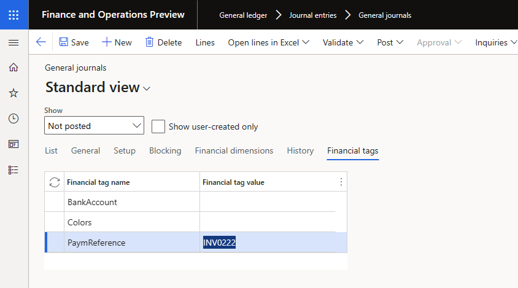
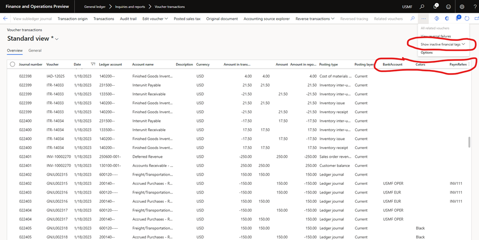

---
# required metadata

title: Financial tags 
description: This article describes financial tags.
author: kweekley
ms.date: 01/23/2023
ms.topic: article
ems.prod: 
ms.technology: 

# optional metadata

ms.search.form: DimensionFocus, LedgerTrialBalanceListPage
audience: Application User
# ms.devlang: 
ms.reviewer: twheeloc
# ms.tgt_pltfrm: 
ms.custom: 25871
ms.search.region: Global
# ms.search.industry: 
ms.author: kweekley
ms.search.validFrom: 2021-03-23
ms.dyn365.ops.version: 10.0.16

---

# Financial tags

After transactions are posted, it’s common for organizations to require visibility into subledger data for analyzing the accounting entries generated from those transactions. Today, organizations use fields such as document number, description, or financial dimensions to track subledger data within general ledger because it’s difficult to navigate the data model to the subledger data. The type of subledger data often tracked includes sales order numbers or purchase order numbers, the vendor or customer name, a payment reference, an invoice number, or a reference number from external transactions imported into Dynamics 365 Finance. In addition to analytics, the subledger data is also used for processes such as ledger settlement.  

The Financial tags (tags) feature eliminates the need to use document numbers, descriptions or financial dimensions by allowing an organization to create and enter up to 20 user-defined fields on transactions, which are then stored on the accounting entries created for the transaction. Tag values are not stored in any subledger tables, such as customer or vendor transactions.

Tags were introduced on Dynamics 365 Finance release 10.0.32. This release supports the definition of up to 20 user-defined tags, and the ability to enter tag values on the following journals (and corresponding OData and Data management entities):
 - General journal
 - Global general journal

With each new release, tags will be implemented into additional journals, documents, and processes.

## Setup
You must enable the **Financial tags** feature in the **Feature management** workspace to use the functionality. The feature can be disabled at any time. If the feature is enabled, and tags were entered on transactions, all tag values entered on those transactions are maintained in the database if the feature is disabled. The tag values would no longer be visible on any transactions or inquiries within Dynamics 365 Finance. 

The entry of tags on transactions is a similar experience to entering a ledger account with the financial dimensions. Tags don’t use the same control as the ledger account, but they still require a delimiter in between the tag values. Before defining any financial tags, define the tag delimiter on the **General ledger parameters** page. Select **Financial tags** and define the delimiter. The delimiter must not be used within any tag values entered on transactions. The delimiter can't be changed after it’s defined. 

## Create financial tags

Before creating your tags:
 - Evaluate whether the data should be tracked as a financial dimension or a financial tag. Financial tags are an alternative to creating financial dimensions, especially when tracking values that have little or no reusability, such as sales order numbers or purchase order numbers. See [Differences between financial tags and financial dimensions](xxxx.as;asdlf.md), for more information about the differences between financial tags and financial dimensions. 
 - Once a financial tag has been created, it can’t be deleted, it can only be deactivated. Deletion is not permitted to ensure that the tag values are still available for reporting on posted general ledger entries. Activation and deactivation of a financial tag can be done easily and at any time. 
 - The label of each financial tag can be changed at any time, even after transactions are posted. 
 - If no transactions have been posted for the specific tag, changing the label will have no impact. This is useful when you need to repurpose a tag for tracking other data.
 - If transactions have been posted for the specific tag, the tag values don't change. If the tag was originally labeled “Purchase order number” but is later changed to “Sales order number”, the posted accounting entries prior to the label change will still contain the purchase order numbers entered and posted to general ledger. 

After the feature is enabled, each legal entity can define up to 20 tags. Tags are legal entity specific. The Financial tag configuration and Financial tags custom list value entities can be used to quickly import the Tags for each legal entity, making it easier to quickly define the same initial setup.

### Create financial tags on the financial tags page
1.	Go to **General ledger > Chart of accounts > Financial tags > Financial tags**.
2.	Select **New** to create a new financial tag. 
3.	Enter a label for the financial tag. The tag label must start with a character or underscore and it can only contain characters, numbers and underscores. Special characters, including blanks, aren't permitted. 
4.	Select a **Value type** of **Text**, **List**, or **Custom list**. 
5.	If the **Value type** is **List**, select the value source from **Use values from**. The column contains a list of entities from which the tag values can be selected during transaction entry. 
6.	If the **Value type** is set to **Custom list**, select **Tag values** to create the custom list of tag values available for selecting during transaction entry. 
7.	Activate the tag using **Activate**. 

### Entering financial tag values on transactions
Once a single tag is activated, the Financial tags will be available for entry on each transaction that supports the feature. 

### Journals and Lines
When entering journals, tag values can be defined on the journal batch header. The tags on the journal batch header will be used as default values for the lines within the journal. As with other defaults on the journal, the tag values default to new lines added to the journal and not existing lines if the values are added to the header after lines exist. 

### Default values
Tag values entered on journal will default as follows:
 - Single-line voucher
     - Tag values from journal batch header default to Account
     - Tag values from Account default to Offset account
     - If tag values are added to the Account after the Offset account already exists, the tag values will not default to the Offset account
     - If tag values exist on both the Account and Offset account, changes to the tag values will not update the other. For example, if the tag values are changed on the Account, the tag values on the Offset account will not be updated. This is to prevent loss of data if the user manually overrides the default values.
     - When adding a new line, if a new voucher number (which is a new transaction) is assigned, the defaulting starts over. Tag values will never default from lines within one voucher to lines within a different voucher.
 - Multi-line voucher
    - Tag values form the journal batch header default to the Account of each line added to the voucher. 
    - The tag values from the Account on the first line will not default to the Account of the next line of the voucher, and so on. 

 
Tag values will never default from master data. For example, there are no capabilities to define default tag values on customers or vendors. Tags values will also not default automatically with values from the transaction itself. For example, assume a tag was created to track Customer name. If a transaction contains a customer, the customer’s name will not default to the tag value. The value must be manually entered or imported. 

### Validation
When tag values are entered on transactions, no validation occurs during transaction entry or during posting. Even if a tag is defined with a type of List or Custom list, the tag values are not validated to ensure that the value exists within the list. For example, a tag is created with a List type and the Purchase order number is selected as the source of the list. The dropdown will present the list of purchase order numbers but the user can enter a purchase order number that doesn’t exist within the list. 

### Posting transactions with tag values
After posting the transaction, the financial tags are available on the lines of the general ledger account entry. Tags will display on the **Voucher transactions** and **Transactions for <main account>** pages. The financial tags are displayed in separate columns, making it easier to sort and filter. 
For reporting, the tags are not part of the dimension sets, which means it’s not possible to get a summarized balance of transactions for a specific tag value. For example, when looking at the trial balance, you can't get balances per tag value. But when you drill down on the balances from the trial balance, the tag values are shown on the detailed transactions. The detailed transactions can be exported to Excel, including the tag values in separate columns, and they can be summarized there if balances are necessary.  
 

 
 
If a tag is deactivated, the tag values remain on the posted transactions. Deactivated tags don't display by default on inquiry pages but the columns can be added by choosing **Show inactive financial tags**. 

### Correcting tag values after posting
While tags are available for reporting, they're not part of the ledger account and have no impact on financial statements. Because they are used for internal analysis only, edits to the tag values are permitted after transactions are posted.
  
1. In **Feature management**, enable **Allow edits to internal data on general ledger vouchers**. This feature allows certain roles to modify the **Description** of posted accounting entries. When the tags feature is enabled, this feature is enhanced to permit edits to the tag values.
2. After the feature is enabled, go to **Voucher transactions**. 
3. Use the query to find the transactions that you want to edit. 
4. Select the lines within **Voucher transactions**. Select **Edit internal voucher data**. You can only edit lines which are selected. 
 

The page displays the lines selected from Voucher transactions, including the current financial tags and new financial tags. The current values default into the new values, to prevent the user from having to manually enter everything again, and instead only change what is incorrect. The **Bulk update selected records** button can be used to do mass updates. This is helpful to assign tag values to large groups of posted transactions that were incorrect or that didn’t have any tag values defined, such as those posted before the feature was enabled.
