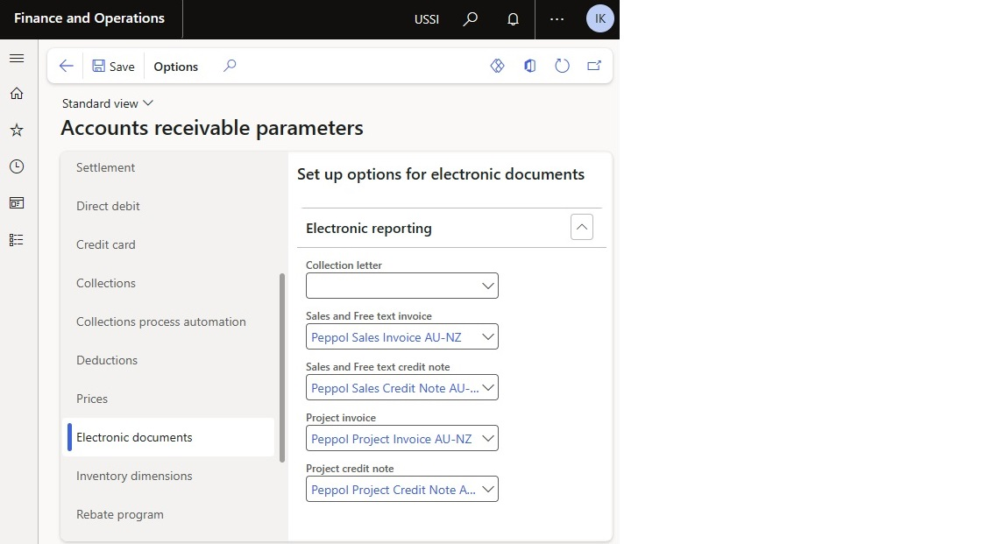

# Customer electronic invoices in Australia and New Zealand

[!include [banner](../includes/banner.md)]

This article provides information about how to configure and issue customer electronic invoices using Australian and New Zealand extension of the [PEPPOL](https://docs.peppol.eu/poacc/billing/3.0/) format specification.

## Prerequisites

1. The primary address of the legal entity must be in Australia and New Zealand.
2. Make sure that the **Electronic invoicing integration** feature disabled in the [Feature management](../../fin-ops-core/fin-ops/get-started/feature-management/feature-management-overview.md) workspace.
3. Do configuration steps described in the [Finance business data configuration](apac-aus-nzl-electronic-invoices.md#finance-business-data-configuration) chapter of the **Get started with Electronic invoicing for Australia and New Zealand** article.
4. Make sure that the following Electronic reporting format configurations are imported. For more information, see [Import Electronic reporting (ER) configurations](../../fin-ops-core/dev-itpro/analytics/electronic-reporting-import-ger-configurations.md).

 - Peppol Sales Invoice AU-NZ
 - Peppol Sales Credit Note AU-NZ
 - Peppol Project Invoice AU-NZ
 - Peppol Project Credit Note AU-NZ

## Additional configuration steps 

### Reference the imported ER format configurations

1. Go to **Accounts receivable** \> **Setup** \> **Accounts receivable parameters**.
2. On the **Electronic documents** tab, on the **Electronic reporting** FastTab, select the imported formats for electronic documents:

    - **Sales and Free text invoice:** Peppol Sales Invoice AU-NZ
    - **Sales and Free text credit note:** Peppol Sales Credit Note AU-NZ
    - **Project invoice:** Peppol Project Invoice AU-NZ
    - **Project credit note:** Peppol Project Credit Note AU-NZ

    

### Configure customer parameters

1. Go to **Accounts receivable** \> **Customers** \> **All customers**, and select a customer.
2. On the **Invoice and delivery** FastTab, set the **eInvoice** option to **Yes** to enable electronic invoices to be generated.
3. Set the **eInvoice attachment** option to **Yes** to attach a PDF copy of the printable invoice to the electronic invoice, if necessary.

## Export customer electronic invoices

### Send e-invoices

When an invoice is posted, you can generate an electronic invoice by selecting **Send** \> **Original** for the selected invoice.

### View e-invoices

To inquire about the XML files of electronic invoices that have been generated, follow these steps.

1. Go to **Organization administration** \> **Electronic reporting** \> **Electronic reporting jobs**.
2. Select a job, and then select **Show files**.

    

3. Select **Open** to download the file that contains the electronic invoice.

If generation of the electronic invoices fails because of errors, select **Show log** \> **Message details** to view more details about the error message.

### Send e-invoices to ER destinations

You can set up ER destinations for electronic invoice formats. In this case, output XML files that contain electronic invoices will automatically be sent to the defined destinations immediately after the invoices are posted. When you post the invoices, you must turn on the **Print invoice** parameter.

For more information about ER destinations, see [Electronic reporting destinations](../../fin-ops-core/dev-itpro/analytics/electronic-reporting-destinations.md).

## Additional resources

- [Forced electronic invoices generation](emea-eur-forced-einvoices.md)
- [Supported standards for electronic invoicing](emea-oioubl-standards-electronic-invoicing.md)

[!INCLUDE[footer-include](../../includes/footer-banner.md)]
