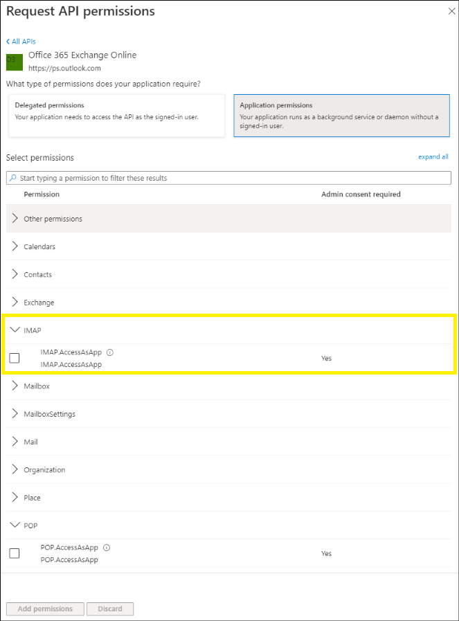
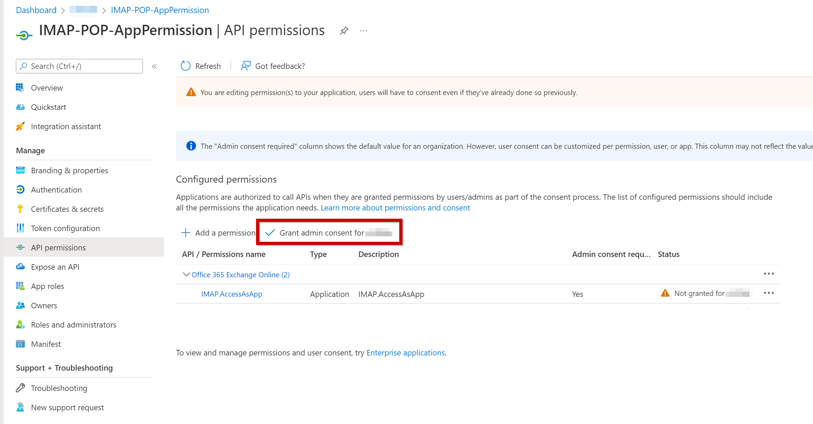
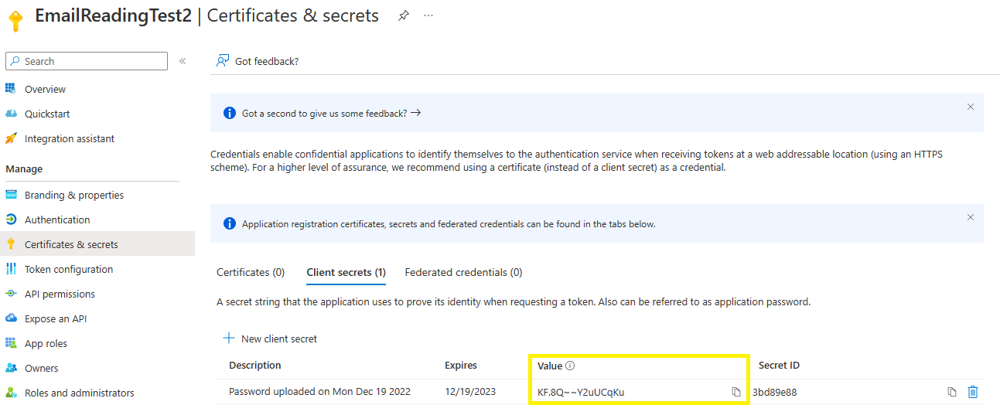

# Configure an email channel for Office 365 Exchange Online

[!include [banner](../includes/banner.md)]

If the Electronic invoicing feature that you created imports electronic vendor invoices from attached files that are received by email, you should configure an email account channel.

## Add the IMAP permissions to your AAD application

1. In the Azure portal, chose the **App registrations** service.
2. Select **New registration** to create new App registration.
3. Give it a name and select **Accounts in this organizational directory only** option in **Supported account types** section. Live other parameters blank.
4. After App registration is created, choose the **API Permissions** blade
5. Select **Add permission**
6. Select the **APIs my organization uses** tab and search for "Office 365 Exchange Online".
7. Select **Application permissions**.
8. For IMAP access, choose the **IMAP.AccessAsApp permission**.

	

9. Once you've chosen which type of permission, select **Add permissions**.
10. To access Exchange mailboxes via IMAP, your AAD application must get tenant admin consent for each tenant. To learn more, see [tenant admin consent process](/azure/active-directory/develop/v2-permissions-and-consent)
    - Choose the API Permissions blade in your Azure AD application's management view.
	- Select **Grant admin consent for** under configured permissions.
	
	

11. Select **Overview** blade and copy **Application (client) ID** value and **Directory (tenant) ID** value.	
12. Select **Certificates & secrets** blade.
13. On the **Client secrets** tab, select **New client secret**. Pay attention on Expiration setting: once a secret expires, it cannot be used anymore and a new secret should be created.
14. After secret is created, copy it's **Value** and save it into Azure Key Vault associated with the Electronic Invoicing Service Environment. Then add a link to this secret into RCS service environment: [Customer certificates and secrets](e-invoicing-customer-certificates-secrets.md)

	

15. Save **Application (client) ID** value as secret into the same Key Vault and add a link to this secret into Electronic Invoicing Service service environment in RCS.
16. In the Azure portal, chose the **Enterprise Applications** service.
17. Find the application with the same name as App registration created in step 3.
18. Copy **Object ID** value from **Overview** blade.

## Register service principals in Exchange

Once your Azure AD application is consented to by a tenant admin, the tenant admin must register your AAD application's service principal in Exchange via Exchange Online PowerShell. To perform this operation, run the next PowerShell snippets, where:

	- <ORGANIZATION_ID> is **Directory (tenant) ID**
	- <APPLICATION_ID> is **Application (client) ID**
	- <OBJECT_ID> is **Object ID**

1. Install the **ExchangeOnlineManagement** module:

	```powershell
    Install-Module -Name ExchangeOnlineManagement -allowprerelease
	Import-module ExchangeOnlineManagement
    ```
	
> [!NOTE]
> ExchangeOnlineManagement module need to be installed only once on the Exchange administrator's machine.
	
2. Connect to your Exchange Online:

	```powershell
	Connect-ExchangeOnline -Organization <ORGANIZATION_ID>
    ```
	
3. The following is an example of registering an Azure AD application's service principal in Exchange:

	```powershell
    New-ServicePrincipal -AppId <APPLICATION_ID> -ServiceId <OBJECT_ID> -Organization <ORGANIZATION_ID>
    ```

4. The following is an example of how to give your application's service principal access to one mailbox:

	```powershell
    Add-MailboxPermission -Identity "john.smith@contoso.com" -User <OBJECT_ID> -AccessRights FullAccess
    ```

> [!NOTE]
> If you get an error running the New-ServicePrincipal Cmdlet after you perform these steps, it is likely due to the fact that the user doesn't have enough permissions in Exchange online to perform the operation or you are trying to perform the operation using guest account.

## Create a feature setup in Regulatory Configuration Service

1. In Regulatory Configuration Service (RCS), select the Electronic invoicing feature that you created. Make sure that you select the version that has a status of **Draft**.
2. On the **Setups** tab, select **Add**.
3. In the **Create feature setup** drop-down dialog box, in the **New** field group, select the **Custom setup** option.
4. In the **Setup type** field group, select the **Data channel** option.
5. In the **Select data channel** field, enter **Incoming e-mail on Exchange**.
6. Select **Create**.
7. Select the line that you created, and then select **Edit**.
8. On the **Data channel** tab, in the **Parameters** section, set the following required fields.

    | Field                | Description |
    |----------------------|-------------|
    | Data channel         | Enter a unique name to identify the data channel. The name can have a maximum of 10 characters. It will be referenced in applicability rules and in connected applications during the communication process. |
    | Server address       | Enter the server address of the Exchange online. For example, the default value for the "Office 365 Exchange Online" is **outlook.office365.com**. |
    | Server port          | Enter the number of the port that the email account provider uses. For example, the default value for the "Office 365 Exchange Online" is **993**. |
    | User name secret     | Enter the name of the Key Vault secret that contains the ID of the email user account. This secret must be created in Key Vault and set up in your service environment. |
    | Client Id	           | Enter the name of the Key Vault secret that contains the **Application (client) ID** value for the App registration. |
	| Client Secret        | Enter the name of the Key Vault secret that contains the App registration client secret **Value**. |
    | Timeout              | The maximum time limit, in milliseconds (ms), that the system should wait for a response. The default value is 10,000 ms (10 seconds). |
    | Main folder          | Specify the email import source, or the folder that the service should process emails from. |
    | Archive folder       | Specify the folder where processed emails should be stored. If you don't specify this folder, the system will automatically create it. |
    | Error folder         | Specify the folder that the system should move emails to if the processing fails. If you don't specify this folder, the system will automatically create it. |
    | Max message size     | Enter the maximum size, in bytes, of a single message that is processed. The default value is 20,000,000 bytes. |
    | Max message number   | Enter the maximum number of messages to process for a single action. If you don't want to limit the number of messages, set the value to **0** (zero). |
    | From filter          | Enter a string to filter by sender address. Only emails where the sender address matches the filter will be processed. This field is optional. To specify multiple sender addresses, use semicolons (;) as separators. |
    | Subject filter       | Enter a string to filter by subject. Only emails where the subject matches the filter will be processed. This field is optional. A simple mask such as **\*smth\*.ext** is supported, where each asterisk (\*) represents zero or more occurrences of any character. |
    | Date filter          | Specify a date to define the maximum age, in days, of messages that are processed. This field is optional. The default value is 30 days. |
    | Processing mode      | <p>Select one of the following options to specify whether all the attachments in an email can be processed together or whether each attachment should be processed separately:</p><ul><li><b>By attachment</b> – A new electronic document will be created for each attachment in the email. For example, if one email includes several files that contain e-invoice data, each file will be considered a new e-invoice in the system.</li><li><b>By email</b> – One attachment will be considered a base attachment, and one electronic invoice will be created in the system. Other attachments can be used as supporting files.</li></ul> |

9. In the **Attachments filter** section, add the file filtering information. Only attachments that satisfy the defined filter will be processed. For example, **\*.xml** will filter for attachments that have the .xml file name extension. The name of the attachment is used in Dynamics 365 Finance or Dynamics 365 Supply Chain Management during setup.

    - If you set the **Processing mode** field to **By email** in the previous step, you can add multiple filters here. The name will identify the specific document.
    - If you set the **Processing mode** field to **By attachment**, you can add only one filter.

10. On the **Applicability rules** tab, review and update the criteria as required. The value of the **Channel** field must equal the value that you entered in the **Data channel** field in step 8.
11. Select **Save**, and close the page.
