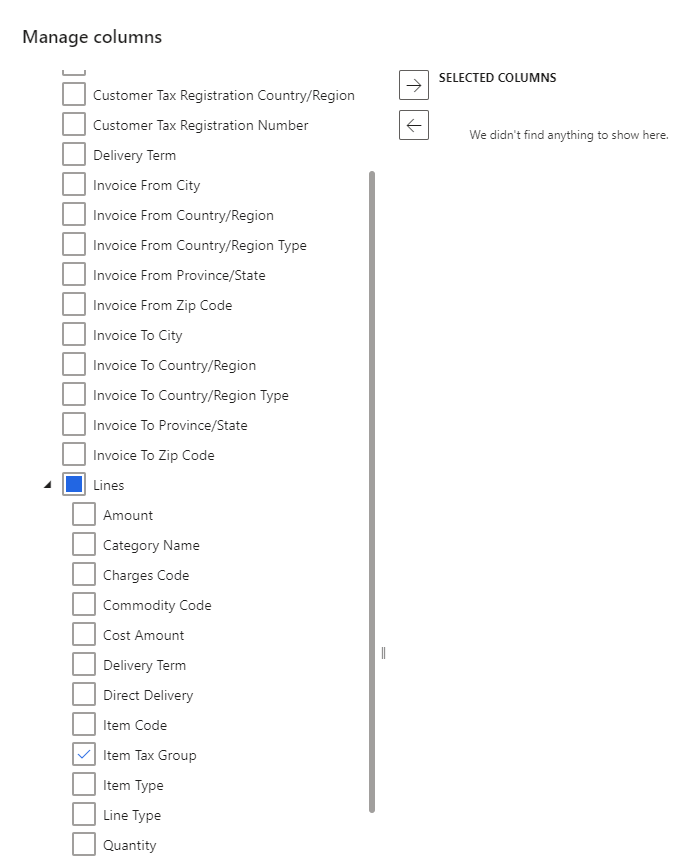

---
# required metadata 

title: Set up item tax groups
description: This article explains how to set up item tax groups in the Tax Calculation service. 
author: wangchen
ms.date: 02/09/2024
ms.topic: how-to 
# optional metadata 

ms.search.form: TaxTable, TaxData   
audience: Application User 
# ms.devlang:  
ms.reviewer: johnmichalak
# ms.tgt_pltfrm:  
# ms.custom:  
ms.search.region: Global
# ms.search.industry: 
ms.author: wangchen
ms.search.validFrom: 2021-10-26 
ms.dyn365.ops.version: Version 10.0.21 
---

# Set up item tax groups

[!include [banner](../../includes/banner.md)]

This article explains how to set up item tax groups in the Tax Calculation feature. It also explains how to set up the item tax group applicability rule matrix and configure lines in the matrix.

The concept of item tax groups in the Tax Calculation feature resembles the concept of item sales tax groups in Microsoft Dynamics 365 Finance. They are groups of tax codes. The Tax Calculation feature uses the intersection of a tax group and an item tax group to determine the tax codes.

> [!IMPORTANT]
> The setup of item tax groups in the Tax Calculation service is legal entity–agnostic. You can complete this setup in Regulatory Configuration Service (RCS) only one time. When you enable the Tax Calculation service in Finance, item tax groups are automatically synced for the selected legal entity.

> [!NOTE]
> The functionality of RCS is merged to the **Globalization Studio** workspace in Finance in version 10.0.39. For more information, see [Regulatory Configuration Service merge to the Globalization Studio workspace](workspace/merge-rcs-to-gsw.md).
>
> If you're using version 10.0.39 or later, use the **Globalization Studio** workspace in Finance instead of RCS.

## Set up an item tax group 

Follow these steps to set up an item tax group.

1. Follow one of these steps, depending on where you're completing the procedure:

    - In [RCS](https://marketing.configure.global.dynamics.com/), open the **Globalization features** workspace, select **Features**, and then select the **Tax Calculation** tile.
    - In Finance, open the **Globalization Studio** workspace, select **Globalization services**, and then select the **Tax Calculation** tile.

2. On the **Tax calculation features** page, select the feature and version that you want to set up, and then select **Edit**.
3. On the **General** tab, select **Configuration version**.
4. On the **Item tax group** tab, select **Manage column**. If you're setting up an item tax group for the first time, the fields in the **Manage column** dialog box are automatically set.
5. In the list on the left, expand the **Lines** node, and select the checkbox for **Item Tax Group**.

    

6. Select the right arrow button to add **Item Tax Group** to the **Selected columns** list on the right.

    

7. Select **OK**.

## Configure an item tax group

After you set up an item tax group, the applicability rule matrix is created. You can add lines to the matrix to configure the item tax group.

1. On the **Item tax group** tab, select **Add**.
2. In the **Item tax group** field, enter the name of the item tax group.

    > [!IMPORTANT]
    > We recommend that you limit the name of the item tax group to 10 characters. This name is synced with Finance, which has a limit of 10 characters for the names of item sales tax groups.

3. In the **Tax codes** field, select the checkbox for each tax code that you want to include in the item tax group. You can include multiple tax codes in one item tax group.

    

4. Repeat steps 1 through 3 to add more item tax groups.

[!INCLUDE[footer-include](../../../includes/footer-banner.md)]
