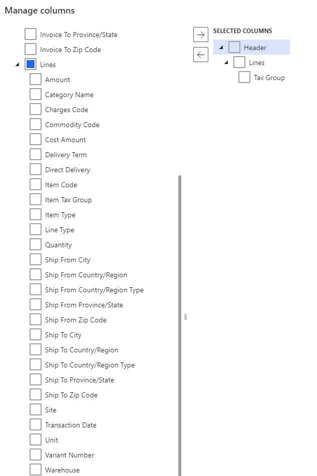
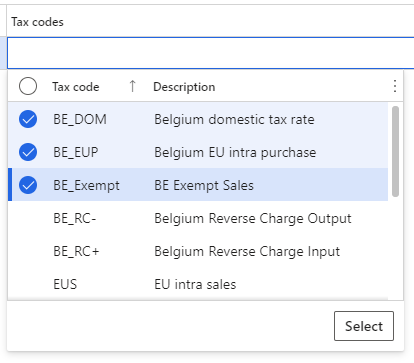

---
# required metadata 

title: Set up tax groups
description: This article explains how to set up tax groups in the Tax Calculation service.
author: wangchen
ms.date: 02/09/2024
ms.topic: how-to 
ms.prod:  
ms.technology:  

# optional metadata 

ms.search.form: TaxTable, TaxData   
audience: Application User 
# ms.devlang:  
ms.reviewer: johnmichalak
# ms.tgt_pltfrm:  
# ms.custom:  
ms.search.region: Global
# ms.search.industry: 
ms.author: wangchen
ms.search.validFrom: 2021-10-26 
ms.dyn365.ops.version: Version 10.0.21 
---

# Set up tax groups

[!include [banner](../../includes/banner.md)]

This article explains how to set up tax groups in the Tax Calculation feature. It also explains how to set up the tax group applicability rule matrix and configure lines in the matrix.

The concept of tax groups in the Tax Calculation feature resembles the concept of sales tax groups in Microsoft Dynamics 365 Finance. They are groups of tax codes. The Tax Calculation feature uses the intersection of a tax group and an item tax group to determine the tax codes.

However, tax groups in the Tax Calculation feature differ from sales tax groups in Finance in that there are no additional parameters on them, such as **Use tax** and **Exempt tax**. Instead, those parameters are available at the tax code level.

> [!IMPORTANT]
> The setup of tax groups in the Tax Calculation service is legal entity–agnostic. You can complete this setup in Regulatory Configuration Service (RCS) only one time. When you enable the Tax Calculation service in Finance, tax groups are automatically synced for the selected legal entity.

> [!NOTE]
> The functionality of Regulatory Configuration Service (RCS) is merged to Dynamics 365 Finance Globalization Studio Workspace in 10.0.39, see [More info](workspace/merge-rcs-to-gsw.md).
>
> If you are on 10.0.39 or higher version, instead of Regulatory Configuration Service (RCS), use Globalization Studio Workspace in Dynamics 365 Finance. 

## Set up a tax group

Follow these steps to set up a tax group.

1. On the **Tax calculation features** page, select the feature and version that you want to set up, and select **Edit**. Depending on where you access it from, follow the navigation:
   
 - In RCS (sign in to [Regulatory Configuration Service](https://marketing.configure.global.dynamics.com/)), open the **Globalization features** workspace, select **Features**, click **Tax Calculation tile**
 - In Finance, open the **Globalization studio workspace**, select **Globalization services**, click **Tax Calculation** tile
   
2. On the **General** tab, select **Configuration version**.
3. On the **Tax group** tab, select **Manage Column**. If you're setting up a tax group for the first time, the fields in the **Manage column** dialog box are automatically set.
4. In the list on the left, expand the **Lines** node, and select the checkbox for **Tax Group**.

    

5. Select the right arrow button to add **Tax Group** to the **Selected columns** list on the right.

    

6. Select **OK**.

## Configure a tax group

After you set up a tax group, the tax group applicability rule matrix is created. You can add lines to the matrix to configure the tax group.

1. On the **Tax group** tab, select **Add**.
2. In the **Tax group** field, enter the name of the tax group.

    > [!IMPORTANT]
    > We recommend that you limit the name of the tax group to 10 characters. This name is synced with Finance, which has a limit of 10 characters for the names of sales tax groups.

3. In the **Tax codes** field, select the checkbox for each tax code that you want to include in the tax group. You can include multiple tax codes in one tax group.

    

4. Repeat steps 1 through 3 to add more tax groups.

[!INCLUDE[footer-include](../../../includes/footer-banner.md)]
