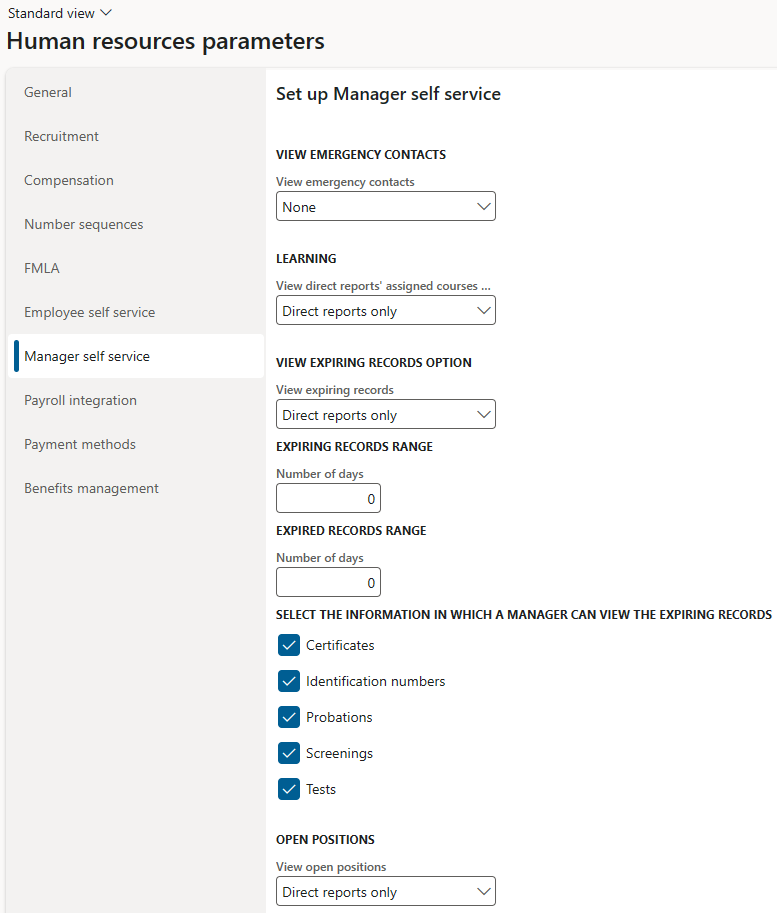

---
# required metadata

title: Configure Manager self service
description: This article explains how to set up Manager self service in Dynamics 365 Human Resources.
author: twheeloc
ms.date: 11/03/2021
ms.topic: article
ms.prod: 
ms.technology: 

# optional metadata

ms.search.form: HRMParameters, HcmPersonnelManagementWorkspace
# ROBOTS: 
audience: Application User
# ms.devlang: 

# ms.tgt_pltfrm: 
ms.custom: 51941
ms.assetid: 2cfb061a-a616-4bf9-9d98-9cde00039eec
ms.search.region: Global
# ms.search.industry: 
ms.author: twheeloc
ms.search.validFrom: 2020-02-03
ms.dyn365.ops.version: Human Resources

---

# Configure Manager self service
[!include [Applies to Human Resources](../includes/applies-to-hr.md)]

The settings on the **Manager self service** tab affect what managers can view on the **Manager self service** workspace. 

Go to **Human Resouces parameters**, select the **Manager self service** tab, and configure the following options: 
 - **View emergency contacts** 
 - **Learning**  
 - **View expiring records** 
 - **Expiring records range** 
 - **Information managers can view in expiring records** 
 - **View open positions**  
 - **View of exiting workers** 
 - **Exiting workers range**
 - **Useful URL links for managers** 

For more information about how to set up **Manager self service**, see [Employee and Manager self service overview](hr-employee-manager-self-service-overview.md). 

]

