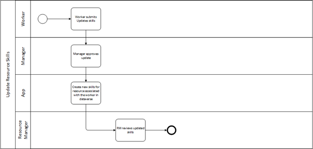

---
# required metadata

title: Human resources to resource integration
description: This article provides details about the integation of Microsoft Dynamics 365 Human Resources workers to bookable resources.
author: tulsijhaveri
ms.date: 1/05/2024
ms.topic: article
ms.prod: 
ms.technology: 

# optional metadata

ms.search.form: BenefitWorkspace, HcmBenefitSummaryPart
# ROBOTS: 
audience: Application User
# ms.devlang: 

# ms.tgt_pltfrm: 

ms.assetid: 
ms.search.region: Global
# ms.search.industry: 
ms.author: tulsijhaveri
ms.search.validFrom: 2020-02-03
ms.dyn365.ops.version: Human Resources

---

# Human resources to resource integration

Human resources to resource integration enables organizations to integrate their worker information. By bringing together worker information, including information about skills and proficiencies, the integration enhances the resource manager's experience and helps them find the best resources for a requirement. This functionality alleviates the pain of double entry and maintenance of workers and characteristics. This data no longer has to be entered and maintained in both Microsoft Dynamics 365 Project Operations and other areas that use the Universal Resource Scheduling (URS) solution for resource scheduling.

This feature enables resource managers to achieve these goals:

- Set up existing workers in Dynamics 365 Human Resources as bookable resources in Project Operations.
- Find or book resources based on the skills and certificates that are associated with workers in Human Resources.

## Integration terminology

| Human Resources | Resource Management |
| --- | --- |
| Worker | Resource |
| Skills | Characteristics |
| Certificates | Characteristics |
| Rating models | Proficiency models |

## Integration dataflow

1. **Human Resources:** Workers and their related skills and certificates are created.
2. **Integration app:** New skills/certificates are created for the resource that's associated with a worker in Dataverse.
3. **Project Operations:** The resource manager reviews the updated characteristics (skills/certificates).

## Process

Human Resources to resource integration uses dual-write. For more information, see [Dual-write](../fin-ops-core/dev-itpro/data-entities/dual-write/dual-write-overview.md). The dual-write infrastructure provides near-real-time integration from Human Resources to Resource Management. For more information, see [Guidance for dual-write setup](../fin-ops-core/dev-itpro/data-entities/dual-write/connection-setup.md).

## Prerequisites

Power Platform Integration is a feature that's enabled in Microsoft Dynamics Lifecycle Services. It lets administrators link their finance and operations environments with new or existing Microsoft Power Platform–based environments. For more information, see [Enable Power Platform Integration](../fin-ops-core/dev-itpro/power-platform/enable-power-platform-integration.md).

### Install and connect Dynamics 365 applications

Some of the following dual-write solutions might be required, depending on your organization's integration points:

- Dual-write core solution (Required)
- Dual-write Dynamics 365 Human Resources (Required)
- Dual-write Finance
- Dual-write Supply Chain 
- Dynamics 365 Human Resources common tables (Required)
- Finance and operations virtual entity
- Microsoft Dynamics 365 Project Operations

> [!NOTE]
> The dual-write solutions that are required depend on the customer's scenario: whether they're using the integration with Dynamics 365 Field Service, Project Operations, or Scheduling.

## Install the solution from Power Platform admin center 

Follow these steps to install the integration from Power Platform admin center:

1. Sign in to Power Platform admin center.
2. On the left navigation, under **Resources**, select **Dynamics 365 apps**.
3. Select **Install app**.
4. In the **Install Dynamics 365 apps** dialog box, select **Dynamics 365 Human Resources Integration to URS**, and then select **Next**.

5. Agree to the terms of service to install the app.

    While solution installation is in progress, the status is **Installing**. After the solution is installed, the status is changed to **Installed**.

   

## Install dual-write packages

The dual-write Human Resources package contains the solutions and maps that are required to sync Human Resources data. For more information, see [Dual-write Human Resources](../fin-ops-core/dev-itpro/data-entities/dual-write/separated-solutions.md#dual-write-human-resources).

## Enable dual-write maps

Dual-write is an out-of-box infrastructure that provides near-real-time interaction between customer engagement apps and finance and operations apps. For more information, see [Enable dual-write for existing finance and operations apps](../fin-ops-core/dev-itpro/data-entities/dual-write/enable-dual-write.md).

## Integration process

By installing and applying the **Dynamics 365 Human Resources Integration to URS** solution, organizations can integrate the catalog of skills, certificates, and related information in Human Resources with the characteristics table in Dataverse. The integration also includes mapping for rating models and rating levels.

In addition to providing dual-write maps, the solution includes virtual entities. Because the solution takes a dependency on virtual entities for skills and certificates, those skills and certificates are automatically generated after the dual-write package is installed.

Relevant business events are registered in Human Resources. Then, when there are changes to the entities, Dataverse can consume those changes.

## Create skills

You can track your workers' skills in Human Resources. You can also specify the skills that are required for a specific job. For more information, see [Create skills](hr-develop-skills.md).

## Create certificates

You can track workers' certificates in Human Resources by creating a library of certificate types and certificates. Certificates can then be added to a worker record to indicate the certificates that the worker has earned. You can also specify the certificates that are required for a specific job.

## Define skills and proficiencies in Project Operations

Skills are resource characteristics that are shared between Project Operations and, if it's present, Field Service. For more information, see [Defining skills and proficiencies](/dynamics365/project-operations/resource-management/define-skills-proficiencies).

## Turn off the integration

If the integration is turned off, the field on bookable resources is removed. The data that's associated with the field is also removed. Any characteristics that were added on the worker through the integration remain on the bookable resource after the integration is turned off.
