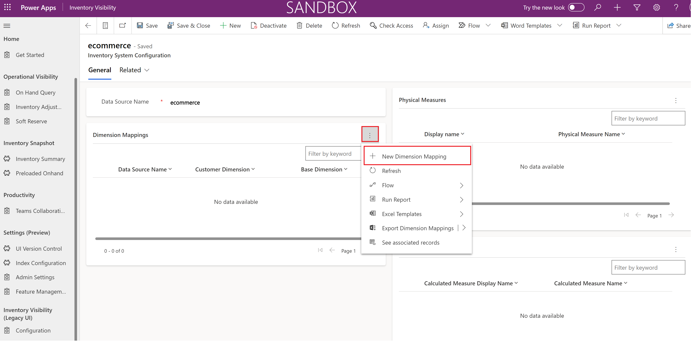
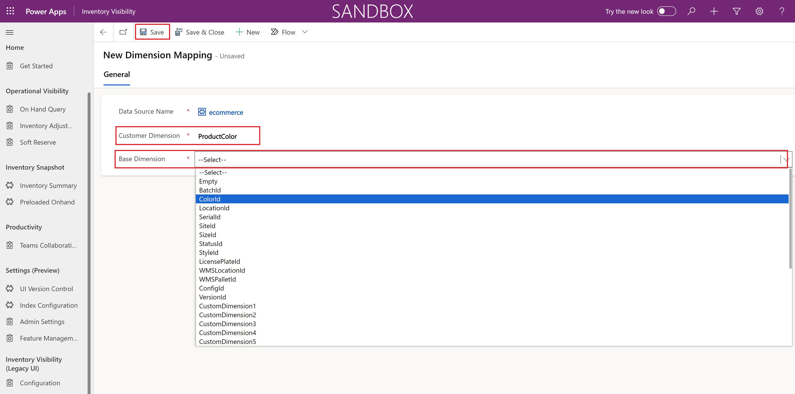
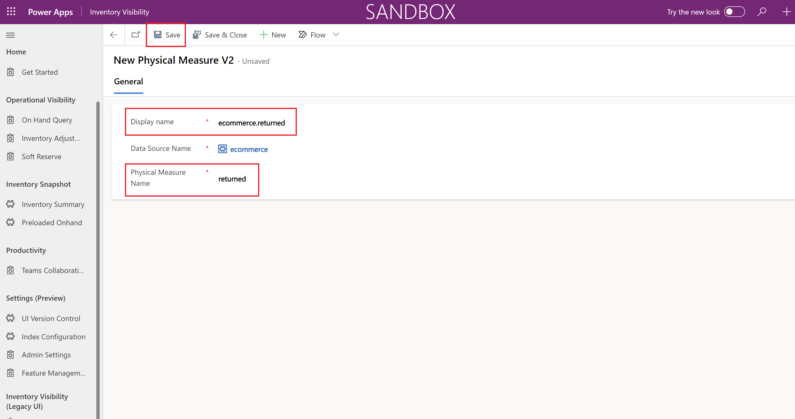
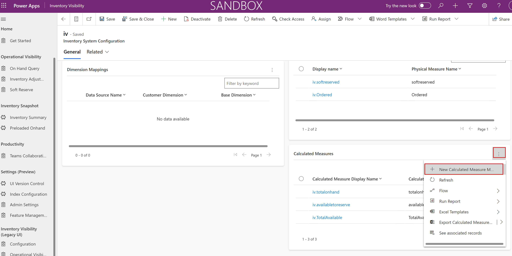
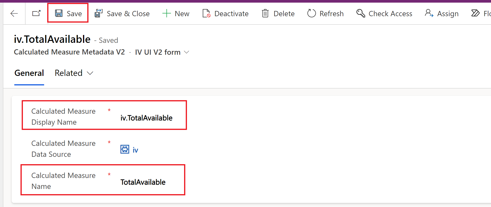
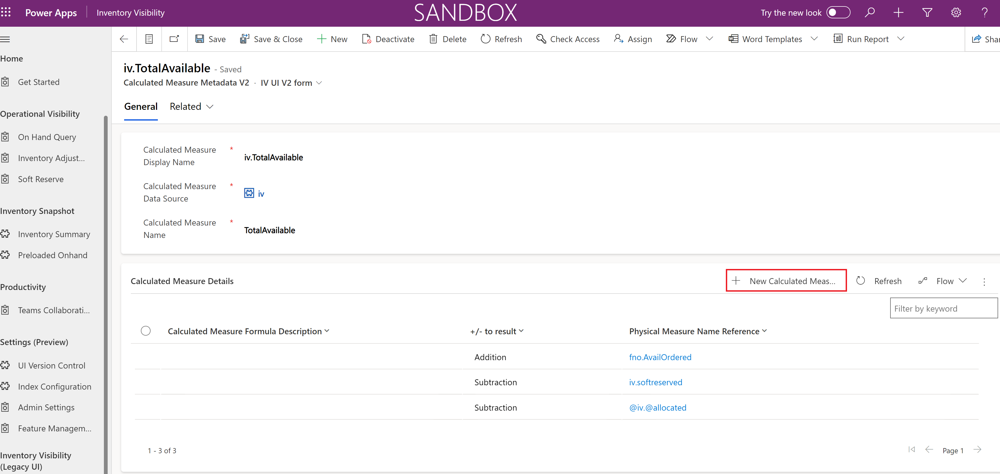
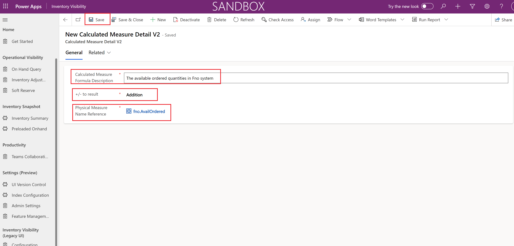

# Configure Inventory Visibility Data Source

[!include [banner](../includes/banner.md)]

This article offers a comprehensive overview of data source configuration within the Inventory Visibility app on Power Apps. It covers the essential steps for setting up and optimizing data source configurations to enhance your inventory management processes.

> [!NOTE]
>Users working with the legacy UI can find specific guidance on data source configurations in [Set data source configuration on V1](#set-configuration-v1).
>
>Users who have recently transitioned from the legacy version to the latest UI can access the dedicated comparison guide [Detailed setups for different features and configurations in Version 2](#differences-between-v1-and-v2). This resource concisely outlines the key disparities between UI v2 and v1, allowing for a smooth adaptation and effective utilization of the latest features.


## Prerequisites

Before you begin, install and set up the Inventory Visibility Add-in as described in [Install and set up Inventory Visibility](inventory-visibility-setup.md).

## <a name="data-source-configuration"></a>Data source configuration

Each data source represents a system that your data comes from. Example data source names include `fno` (which corresponds to Supply Chain Management) and `pos` (which stands for "point of sale"). By default, Supply Chain Management is set up as a default data source (`fno`) in Inventory Visibility.

> [!NOTE]
> The `fno` data source is reserved for Supply Chain Management. If your Inventory Visibility Add-in is integrated with a Supply Chain Management environment, we recommend that you don't delete configurations that are related to `fno` in the data source.

To add a data source, follow these steps.

1. Sign in to your Power Apps environment, and open **Inventory Visibility**.
1. Open the **Feature management** page.
1. Click **Manage** button in the right side of **Data Source Settings** section to open **Data source settings** page

1. On **Data source settings** page, select **New** to add a data source (for example `ecommerce` or another meaningful data source ID).
1. Select **Save**.
   
> [!NOTE]
> When you add a data source, be sure to validate your data source name, physical measures, and dimension mappings before you update the configuration for the Inventory Visibility service. You won't be able to modify these settings after you select **Update Configuration**.

The data source configuration includes the following parts:

- Dimensions (dimension mapping)
- Physical measures
- Calculated measures

### <a name="data-source-configuration-dimension"></a>Dimensions (dimension mapping)

The purpose of the dimension configuration is to standardize the multi-system integration for posting events and queries, based on dimension combinations. Inventory Visibility provides a list of base dimensions that can be mapped from the dimensions of your data source. Thirty-three dimensions are available for mapping.

- If you're using Supply Chain Management as one of your data sources, 13 dimensions are already mapped to the Supply Chain Management standard dimensions by default. The other 12 dimensions (`inventDimension1` through `inventDimension12`) are also mapped to custom dimensions in Supply Chain Management. The remaining eight dimensions (`ExtendedDimension1` through `ExtendedDimension8`) are extended dimensions that you can map to external data sources.
- If you don't use Supply Chain Management as one of your data sources, you can freely map the dimensions. The following table shows the full list of available dimensions.

> [!NOTE]
> If you use Supply Chain Management, and change the default dimension mappings between Supply Chain Management and Inventory Visibility, the changed dimension won't sync data. Therefore, if your dimension isn't on the default dimension list, and you're using an external data source, we recommend that you use `ExtendedDimension1` through `ExtendedDimension8` to do the mapping.

| Dimension type | Base dimension |
|---|---|
| Product | `ColorId` |
| Product | `SizeId` |
| Product | `StyleId` |
| Product | `ConfigId` |
| Tracking | `BatchId` |
| Tracking | `SerialId` |
| Location | `LocationId` |
| Location | `SiteId` |
| Inventory status | `StatusId` |
| Warehouse specific | `WMSLocationId` |
| Warehouse specific | `WMSPalletId` |
| Warehouse specific | `LicensePlateId` |
| Others | `VersionId` |
| Inventory (custom) | `InventDimension1` through `InventDimension12` |
| Extension | `ExtendedDimension1` through `ExtendedDimension8` |
| System | `Empty` |

> [!NOTE]
> The dimension types that are listed in the preceding table are for your reference only. You don't have to define them in Inventory Visibility.
>
> The inventory (custom) dimensions might be reserved for Supply Chain Management. In that case, use the extended dimensions instead.

External systems can access Inventory Visibility through its RESTful APIs. For the integration, Inventory Visibility lets you configure the *external data source* and the mapping from the *external dimensions* to the *base dimensions*. Here's an example of a dimension mapping table.

| External dimension | Base dimension |
|---|---|
| `MyColorId` | `ColorId` |
| `MySizeId` | `SizeId` |
| `MyStyleId` | `StyleId` |
| `MyDimension1` | `ExtendedDimension1` |
| `MyDimension2` | `ExtendedDimension2` |

By configuring a dimension mapping, you can send the external dimensions directly to Inventory Visibility. Inventory Visibility will then automatically convert external dimensions to base dimensions.

To add dimension mappings, follow these steps.
1. Sign in to your Power Apps environment, and open **Inventory Visibility**.
1. Open the **Feature management** page.
1. Click **Manage** button in the right side of **Data Source Settings** section to open **Data source settings** page
1. On **Data source settings** page, select the data source where you want to do the dimension mapping. Then, in the **Dimension Mappings** section, select **More Options Icon** and select **New Dimension Mapping**.
   
1. On **New Dimension Mapping** page, specify the source dimension in **Customer dimension** field, and select the dimension in Inventory Visibility that you want to map in **Base Dimension** field.
1. Select **Save**.
   

For example, you've already created a data source that is named `ecommerce`, and it includes a product color dimension. In this case, to do the mapping, you can first add `ProductColor` to the **Dimension Name** field in the `ecommerce` data source and then select `ColorId` in the **To Base Dimension** field.

### <a name="data-source-configuration-physical-measures"></a>Physical measures

When a data source posts an inventory change to Inventory Visibility, it posts that change by using *physical measures*. Physical measures modify the quantity and reflect the inventory status. You can define your own physical measures based on your requirements. Queries can be based on the physical measures.

Inventory Visibility provides a list of default physical measures that are mapped to Supply Chain Management (the `fno` data source). These default physical measures are taken from the inventory transaction statuses on the **On-hand list** page in Supply Chain Management (**Inventory Management \> Inquiries and Report \> On-hand list**). The following table provides an example of physical measures.

| Physical measure name | Description |
|---|---|
| `NotSpecified` | Not specified |
| `Arrived` | Arrived |
| `AvailOrdered` | Available ordered |
| `AvailPhysical` | Available physical |
| `Deducted` | Deducted |
| `OnOrder` | OnOrder |
| `Ordered` | Ordered |
| `PhysicalInvent` | Physical inventory |
| `Picked` | Picked |
| `PostedQty` | Posted quantity |
| `QuotationIssue` | Quotation issue |
| `QuotationReceipt` | Quotation receipt |
| `Received` | Received |
| `Registered` | Registered |
| `ReservOrdered` | Ordered reserved |
| `ReservPhysical` | Physical reserved |
| `OrderedSum` | Ordered in total |

If your data source is Supply Chain Management, you don't have to re-create the default physical measures. However, for external data sources, you can create new physical measures by following these steps.

1. Sign in to your Power Apps environment, and open **Inventory Visibility**.
1. Open the **Feature management** page.
1. Click **Manage** button in the right side of **Data Source Settings** section to open **Data source settings** page
1. On **Data source settings** page, select the data source where you want to do the dimension mapping. Then, in the **Physical Measure** section, select **More Options Icon** and select **New Physical Measure V2**.
   
1. On **New Physical Measure V2** page, set the following fields for the new physical measure:
   - **Physical Measure Name**– Enter the name of the physical measure.
   - **Display Name** – Enter a name that is unique not only within its own data source but also across different data sources. The recommended format is `[Data Source].[Physical Measure Name]`, similar to `ecommerce.returned`. This ensures that the Display Name remains distinct and does not duplicate in any data source.
2. Select **Save**.
   


### Extended dimensions

Customers who want to use external data sources in the data source can take advantages of the extensibility that Dynamics 365 offers by creating [Class Extensions](../../fin-ops-core/dev-itpro/extensibility/class-extensions.md) for the `InventOnHandChangeEventDimensionSet` and `InventInventoryDataServiceBatchJobTask` classes.

Be sure to synchronize with the database after creating the extensions in order for the custom fields to be added in the `InventSum` table. You can then refer to the "Dimensions" section earlier in this article, to map your custom dimensions to any of the eight extended dimensions in `BaseDimensions` in Inventory.

> [!NOTE] 
> For additional details about creating extensions, see [Extensibility home page](../../fin-ops-core/dev-itpro/extensibility/extensibility-home-page.md).

### Calculated measures

You can use Inventory Visibility to query on both inventory physical measures and *custom calculated measures*. Calculated measures provide a customized computation formula that consists of a combination of physical measures. This functionality lets you define a set of physical measures that will be added, and/or a set of physical measures that will be subtracted, to form the customized measurement.

> [!IMPORTANT]
> A calculated measure is a composition of physical measures. Its formula can include only physical measures without duplicates, not calculated measures.

The configuration lets you define a set of calculated measure formulas that includes modifiers of addition or subtraction to get the total aggregated output quantity.

To set up a custom calculated measure, follow these steps.

1. Sign in to your Power Apps environment, and open **Inventory Visibility**.
1. Open the **Feature management** page.
1. Click **Manage** button in the right side of **Data Source Settings** section to open **Data source settings** page.
1. On **Data source settings** page, select the data source where you want to do the dimension mapping. Then, in the **Calculated Measures** section, select **More Options Icon** and select **New Calculated Measures Metadata V2**.
   
1. On **New Calculated Measure V2** page, set the following fields for the new calculated measure:
   - **Calculated Measure Name** – Enter the name of the calculated measure.
   - **Calculated Measure Display Name** – Enter a unique name that should be distinct not only within its own data source but also across different data sources. The recommended format is `[Data Source].[Calculated Measure Name]`, similar to `iv.TotalAvailable`. While the Calculated Measure Name can be the same between different data sources, it is essential to ensure that the Calculated Measure Display Name remains distinct and does not duplicate across data sources.
  
   

1. Select **New Calculated Measure Details V2** in **Calculated Measure Details** to add a new modifier to the new calculated measure.

   

1. On **New Calculated Measure Detail V2** page, set the following fields for the new modifier:
    - **Calculated Measure Formula Description** - Provides a detailed explanation of the significance and purpose of the formula within the calculated measure.
    - **+/- to result** – Select the modifier type (*Addition* or *Subtraction*).
    - **Physical Measure Name Reference** – Select the name of the measure (from the selected data source) that provides the value for the modifier.

1.  Repeat steps 5 through 6 until you've added all the required modifiers and completed the formula for your calculated measure.
1.  Select **Save**.

For example, a fashion company operates across three data sources:

- `pos` – Corresponds to the store channel.
- `fno` – Corresponds to Supply Chain Management.
- `ecommerce` – Corresponds to your web channel.

Without calculated measures, when you query for product D0002 (Cabinet) under site 1, warehouse 11, and a `ColorID` dimension value of `Red`, you might get the following query result, which shows inventory quantities under each preconfigured physical measure. However, you don't have visibility into the total available for reservation quantities across your data sources.

```json
[
    {
        "productId": "D0002",
        "dimensions": {
            "SiteId": "1",
            "LocationId": "11",
            "ColorId": "Red"
        },
        "quantities": {
            "pos": {
                "inbound": 80.0,
                "outbound": 20.0
            },
            "fno": {
                "availphysical": 100.0,
                "orderedintotal": 50.0,
                "orderedreserved": 10.0
            },
            "ecommerce": {
                "received": 90.0,
                "scheduled": 30.0,
                "issued": 60.0,
                "reserved": 40.0
            }
        }
    }
]
```

You then configure a calculated measure that is named `MyCustomAvailableforReservation`, as shown in the following table. This calculated measure will be consumed by the consumption system.

| Consumption system | Calculated measure | Data source | Physical measure | Calculation type |
|---|---|---|---|---|
| `CrossChannel` | `MyCustomAvailableforReservation` | `fno` | `availphysical` | `Addition` |
| `CrossChannel` | `MyCustomAvailableforReservation` | `fno` | `orderedintotal` | `Addition` |
| `CrossChannel` | `MyCustomAvailableforReservation` | `fno` | `orderedreserved` | `Subtraction` |
| `CrossChannel` | `MyCustomAvailableforReservation` | `pos` | `inbound` | `Addition` |
| `CrossChannel` | `MyCustomAvailableforReservation` | `pos` | `outbound` | `Subtraction` |
| `CrossChannel` | `MyCustomAvailableforReservation` | `ecommerce` | `received` | `Addition` |
| `CrossChannel` | `MyCustomAvailableforReservation` | `ecommerce` | `scheduled` | `Addition` |
| `CrossChannel` | `MyCustomAvailableforReservation` | `ecommerce` | `issued` | `Subtraction` |
| `CrossChannel` | `MyCustomAvailableforReservation` | `ecommerce` | `reserved` | `Subtraction` |

When this computation formula is used, the new query result will include the customized measurement.

```json
[
    {
        "productId": "D0002",
        "dimensions": {
            "SiteId": "1",
            "LocationId": "11",
            "ColorId": "Red"
        },
        "quantities": {
            "pos": {
                "inbound": 80.0,
                "outbound": 20.0
            },
            "fno": {
                "availphysical": 100.0,
                "orderedintotal": 50.0,
                "orderedreserved": 10.0
            },
            "ecommerce": {
                "received": 90.0,
                "scheduled": 30.0,
                "issued": 60.0,
                "reserved": 40.0
            },
            "CrossChannel": {
                "MyCustomAvailableforReservation": 220.0
            }
        }
    }
]
```

## <a name="default-configuration-sample"></a>Default configuration sample

During its initialization stage, Inventory Visibility sets up a default configuration, which is detailed here. You can modify this configuration as you require.

### Data source configuration

#### Configuration of the iv data source

This section describes how the `iv` data source is configured.

##### Physical measures configured for the "iv" data source

The following physical measures are configured for the `iv` data source:

- `Ordered`
- `SoftReservPhysical`
- `SoftReservOrdered`
- `ReservOrdered`
- `ReservPhysical`

##### OrderedTotal calculated measure

The `OrderedTotal` calculated measure is configured for the `iv` data source as shown in the following table.

| Calculation type | Data source | Physical measure |
|---|---|---|
| Addition | `fno` | `Ordered` |
| Addition | `fno` | `Arrived` |
| Addition | `iv` | `Ordered` |

##### OnHand calculated measure

The `OnHand` calculated measure is configured for the `iv` data source as shown in the following table.

| Calculation type | Data source | Physical measure |
|---|---|---|
| Addition | `fno` | `PhysicalInvent` |
| Addition | `iom` | `OnHand` |
| Addition | `erp` | `Unrestricted` |
| Addition | `erp` | `QualityInspection` |
| Addition | `pos` | `PosInbound` |
| Subtraction | `pos` | `PosOutbound` |

##### ReservedTotal calculated measure

The `ReservedTotal` calculated measure is configured for the `iv` data source as shown in the following table.

| Calculation type | Data source | Physical measure |
|---|---|---|
| Addition | `fno` | `ReservPhysical` |
| Addition | `fno` | `ReservOrdered` |
| Addition | `iv` | `SoftReservPhysical` |
| Addition | `iv` | `SoftReservOrdered` |
| Addition | `iv` | `ReservPhysical` |
| Addition | `iv` | `ReservOrdered` |

##### SoftReserved calculated measure

The `SoftReserved` calculated measure is configured for the `iv` data source as shown in the following table.

| Calculation type | Data source | Physical measure |
|---|---|---|
| Addition | `iv` | `SoftReservPhysical` |
| Addition | `iv` | `SoftReservOrdered` |

##### HardReserved calculated measure

The `HardReserved` calculated measure is configured for the `iv` data source as shown in the following table.

| Calculation type | Data source | Physical measure |
|---|---|---|
| Addition | `fno` | `ReservPhysical` |
| Addition | `fno` | `ReservOrdered` |
| Addition | `iv` | `ReservPhysical` |
| Addition | `iv` | `ReservOrdered` |

##### OpenOrder calculated measure

The `OpenOrder` calculated measure is configured for the `iv` data source as shown in the following table.

| Calculation type | Data source | Physical measure |
|---|---|---|
| Addition | `fno` | `OnOrder` |
| Addition | `iom` | `OnOrder` |

##### OnHandAvailable calculated measure

The `OnHandAvailable` calculated measure is configured for the `iv` data source as shown in the following table.

| Calculation type | Data source | Physical measure |
|---|---|---|
| Addition | `fno` | `PhysicalInvent` |
| Addition | `iom` | `OnHand` |
| Addition | `erp` | `Unrestricted` |
| Addition | `erp` | `QualityInspection` |
| Addition | `pos` | `PosInbound` |
| Subtraction | `fno` | `ReservPhysical` |
| Subtraction | `iv` | `SoftReservPhysical` |
| Subtraction | `pos` | `PosOutbound` |

##### AvailableToReserve calculated measure

The `AvailableToReserve` calculated measure is configured for the `iv` data source as shown in the following table.

| Calculation type | Data source | Physical measure |
|---|---|---|
| Addition | `fno` | `PhysicalInvent` |
| Addition | `iom` | `OnHand` |
| Addition | `erp` | `Unrestricted` |
| Addition | `erp` | `QualityInspection` |
| Addition | `pos` | `PosInbound` |
| Addition | `fno` | `Ordered` |
| Addition | `fno` | `Arrived` |
| Addition | `iv` | `Ordered` |
| Subtraction | `fno` | `ReservPhysical` |
| Subtraction | `fno` | `ReservOrdered` |
| Subtraction | `iv` | `SoftReservPhysical` |
| Subtraction | `iv` | `SoftReservOrdered` |
| Subtraction | `iv` | `ReservPhysical` |
| Subtraction | `iv` | `ReservOrdered` |
| Subtraction | `pos` | `PosOutbound` |

##### InventorySupply calculated measure

The `InventorySupply` calculated measure is configured for the `iv` data source as shown in the following table.

| Calculation type | Data source | Physical measure |
|---|---|---|
| Addition | `fno` | `Ordered` |
| Addition | `fno` | `Arrived` |
| Addition | `iv` | `Ordered` |
| Addition | `fno` | `PhysicalInvent` |
| Addition | `iom` | `OnHand` |
| Addition | `erp` | `Unrestricted` |
| Addition | `erp` | `QualityInspection` |
| Addition | `pos` | `PosInbound` |
| Subtraction | `pos` | `PosOutbound` |

##### InventoryDemand calculated measure

The `InventoryDemand` calculated measure is configured for the `iv` data source as shown in the following table.

| Calculation type | Data source | Physical measure |
|---|---|---|
| Addition | `fno` | `OnOrder` |
| Addition | `iom` | `OnOrder` |
| Addition | `iv` | `SoftReservPhysical` |
| Addition | `iv` | `SoftReservOrdered` |
| Addition | `fno` | `ReservPhysical` |
| Addition | `fno` | `ReservOrdered` |
| Addition | `iv` | `ReservPhysical` |
| Addition | `iv` | `ReservOrdered` |

#### Configuration of the "fno" data source

This section describes how the `fno` data source is configured.

##### Dimension mappings for the "fno" data source

The dimension mappings that are listed in the following table are configured for the `fno` data source.

| External dimension | Base dimension |
|---|---|
| `InventBatchId` | `BatchId` |
| `InventColorId` | `ColorId` |
| `InventLocationId` | `LocationId` |
| `InventSerialId` | `SerialId` |
| `InventSiteId` | `SiteId` |
| `InventSizeId` | `SizeId` |
| `InventStatusId` | `StatusId` |
| `InventStyleId` | `StyleId` |
| `LicensePlateId` | `LicensePlateId` |
| `WMSLocationId` | `WMSLocationId` |
| `WMSPalletId` | `WMSPalletId` |
| `ConfigId` | `ConfigId` |
| `InventVersionId` | `VersionId` |
| `InventDimension1` | `CustomDimension1` |
| `InventDimension2` | `CustomDimension2` |
| `InventDimension3` | `CustomDimension3` |
| `InventDimension4` | `CustomDimension4` |
| `InventDimension5` | `CustomDimension5` |
| `InventDimension6` | `CustomDimension6` |
| `InventDimension7` | `CustomDimension7` |
| `InventDimension8` | `CustomDimension8` |
| `InventDimension9` | `CustomDimension9` |
| `InventDimension10` | `CustomDimension10` |
| `InventDimension11` | `CustomDimension11` |
| `InventDimension12` | `CustomDimension12` |

##### Physical measures configured for the "fno" data source

The following physical measures are configured for the `fno` data source:

- `Arrived`
- `PhysicalInvent`
- `ReservPhysical`
- `onorder`
- `notspecified`
- `availordered`
- `availphysical`
- `picked`
- `postedqty`
- `quotationreceipt`
- `received`
- `ordered`
- `ReservOrdered`

#### Configuration of the "pos" data source

This section describes how the data source `pos` is configured.

##### Physical measures for the "pos" data source

The following physical measures are configured for the `pos` data source:

- `PosInbound`
- `PosOutbound`

##### AvailQuantity calculated measure

The `AvailQuantity` calculated measure is configured for the `pos` data source as shown in the following table.

| Calculation type | Data source | Physical measure |
|---|---|---|
| Addition | `fno` | `AvailPhysical` |
| Addition | `pos` | `PosInbound` |
| Subtraction | `pos` | `PosOutbound` |

#### Configuration of the "iom" data source

The following physical measures are configured for the `iom` (intelligent order management) data source:

- `OnOrder`
- `OnHand`

#### Configuration of the "erp" data source

The following physical measures are configured for the `erp` (enterprise resource planning) data source:

- `Unrestricted`
- `QualityInspection`


## <a name="differences-between-v1-and-v2"></a>Differences between Version1 and Version 2

**Physical measures**: Unlike version 1, user no longer needs to specify the data source for a physical measure, it's by default the current data source.
**Calculated measures**: Unlike version 1, user specifies the measure in two steps: (1) Calculated measre metadata to specify the name and data source for a calculated measure; and (2) Calculated measure detail, each record consists of an addition / subtraction operator of an existing physical measure to a calculated measure with specified metadata.

## <a name="set-configuration-v1"></a>Set data source configuration on V1

#### Data source configuration
Add data source, follow these steps:
1. Sign in to your Power Apps environment, and open **Inventory Visibility**.
2. Open the **Configuration** page.
3. On the **Data Source** tab, select **New Data Source** to add a data source (for example `ecommerce` or another meaningful data source ID).

> [!NOTE]
> When you add a data source, be sure to validate your data source name, physical measures, and dimension mappings before you update the configuration for the Inventory Visibility service. You won't be able to modify these settings after you select **Update Configuration**.

#### Dimension mappings configuration
Add dimension mappings, follow these steps:
1. Sign in to your Power Apps environment, and open **Inventory Visibility**.
1. Open the **Configuration** page.
1. On the **Data Source** tab, select the data source where you want to do the dimension mapping. Then, in the **Dimension Mappings** section, select **Add** to add dimension mappings.

    

1. In the **Dimension Name** field, specify the source dimension.
1. In the **To Base Dimension** field, select the dimension in Inventory Visibility that you want to map.
1. Select **Save**.

#### Physical measures configuration
Add new physical measures, follow these steps:
1. Sign in to your Power Apps environment, and open **Inventory Visibility**.
1. Open the **Configuration** page.
1. On the **Data Source** tab, select the data source to add physical measures to (for example, the `ecommerce` data source). Then, in the **Physical Measures** section, select **Add**, and specify the measure name (for example, `Returned` if you want to record returned quantities in this data source to Inventory Visibility). Save your changes.

#### Calculated measures configuration
Add new custom calculated measure, follow these steps:
1. Sign in to your Power Apps environment, and open **Inventory Visibility**.
1. Open the **Configuration** page.
1. On the **Calculated Measure** tab, select **New Calculate Measure** to add a calculated measure.
1. Set the following fields for the new calculated measure:

    - **New calculated measure name** – Enter the name of the calculated measure.
    - **Data source** – Select the data source to include the new calculated measure in. The querying system is a data source.

1. Select **Add** to add a modifier to the new calculated measure.
1. Set the following fields for the new modifier:

    - **Modifier** – Select the modifier type (*Addition* or *Subtraction*).
    - **Data source** – Select the data source where the measure that provides the modifier value should be found.
    - **Measure** – Select the name of the measure (from the selected data source) that provides the value for the modifier.

1. Repeat steps 5 through 6 until you've added all the required modifiers and completed the formula for your calculated measure.
1. Select **Save**.

[!INCLUDE[footer-include](../../includes/footer-banner.md)]