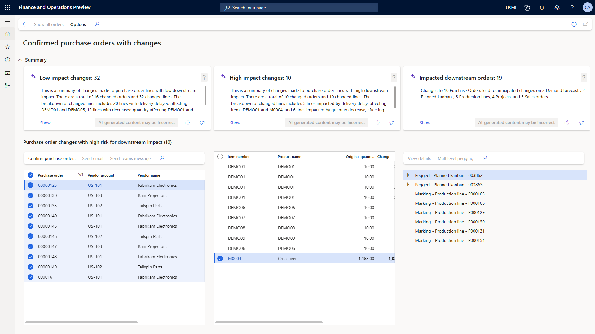
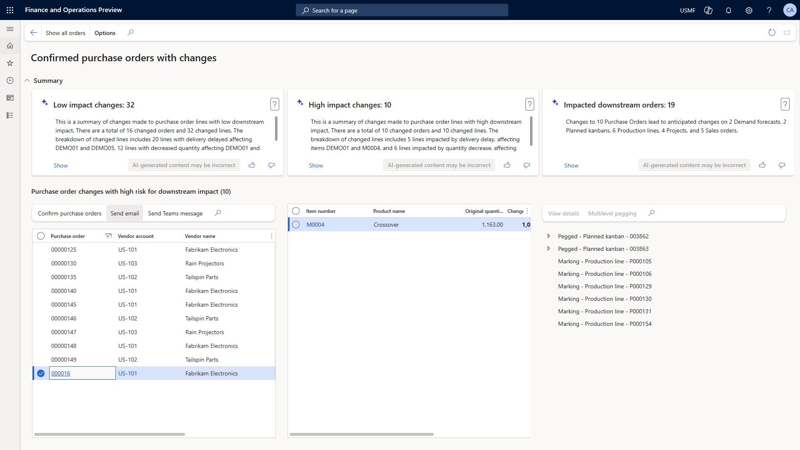

# Review and accept changes to confirm purchase orders

[!include [banner](../includes/banner.md)]

This article describes the workspace where users can review and accept changes to a ‘Confirmed’ purchase order (PO) based on their downstream impact.

> [!NOTE]
> This workspace for procurement is currently in public preview. The capability has been added to the release 10.0.34. Please upgrade the version of finance and operations to application suite version 10.25.1372, which is included in application version 10.0.1591.72.
>During this phase, the summarization of changes and the summarization of downstream impact will only be available in environments hosted in North America and will render in English. All other functionality is available globally.

## Business Value

In the procurement planning process, any changes to the confirmed purchase orders can have a significant impact on downstream processes such as planned production, service work, or sales orders. The new Procurement Order Review Workspace offers an efficient way to identify and reconfirm changes with a low risk of downstream impact. This allows procurement managers to focus on impactful changes, communicate directly with vendors, and assess potential downstream order impacts.

## Enabling the Procurement Order Review Capability

To enable the feature, navigate to the feature management and activate the feature flag: ”Review changes to confirmed purchase orders based on downstream impact”.

## Procurement Order Review Workspace Overview

You can access the workspace by navigating to the workspace with the name "Confirmed purchase orders with changes".

The workspace lists all previously confirmed purchase orders that have been changed after confirmation. It aids the review process by identifying potential impacts on production work, service work orders, and sales orders.

At the top of the workspace, three tiles summarize changed confirmed purchase orders and downstream impacts:

1. **Low Impact Changes:** This tile focuses on purchase orders with low risk for downstream impact, i.e., those with no downstream orders allocated. A generated summary of changes is provided to aid review and validation.

2. **High Impact Changes:** This tile highlights purchase orders with known downstream impacts. These high-risk changes are summarized along with the detected impact, aiding the user in further exploration and decision-making.

3. **Impacted Downstream Orders:** This tile allows the user to review potential downstream impacts based on the last master planning run. It summarizes the impact by the number and type of orders and shows the purchase order changes causing the impact.

Each tile contains a “Show” link, clicking on which filters the list of purchase orders and purchase order lines below. The list columns include original and new quantities, original and new confirmed delivery dates, etc.

## Typical user activities when reviewing changes to confirmed purchase orders

A purchaser can use the workspace to review and accept changes to confirmed purchase orders. The following steps describe the typical user activities:

### 1. Study changes across all confirmed purchase orders and their downstream impact

A purchaser typically will first study all the changes that have been submitted through the purchase order change management process and can arrive from the vendor through different channels.

When entering the workspace it will show all purchase orders with changes. When a purchase order that had previously been confirmed is changed it will move back into the Approved state. The workspace will show all purchase orders that have been changed after confirmation.

The workspace shows two list, one with the purchase orders details, the second with the purchase order lines. 

The purchase order list includes the purchase order number, vendor and the requested receipt date from the purchase order header. Purchase order or vendor can be easily opened from the list by clicking on the purchase order number or vendor account.

The purchase order lines list shows the lines that have proposed changes. This includes item number, the product name, original and new quantity, original and new confirmed delivery date.
It shows as well downstream impact in a hierarchical manner, if such has been identified. The Reference field will highlight the type of downstream impact, such as a Planned Kanban for a production order, a sales order, or a maintenance work order.

### 2. Focus first on changes with low risk of downstream impact

In order to take action effectively and efficiently, the purchaser will often first focus on low impact changes. These are changes that have no known downstream impact according to the current plan.

The tile "Low impact changes" gives a AI generated summary in natural language on the amount of changes with low impact risk. The link Show opens the respective filtered view.

Here the purchaser can review the changes and accept those by reconfirming individual or multiple purchase order using the Menu Confirm purchase orders. The experience to confirm the changes is the same as when confirming a purchase order for the first time and support batch processing. Any extension that is registered for the purchase order confirmation will be executed as well.
Once re-confirmed, the purchase order will then move back into the Confirmed state.

### 3. Review changes with high risk of downstream impact

A Purchaser will spend more time on changes that have a high risk of downstream impact. These are changes that have downstream orders allocated and where the downstream impact has been identified.

The workspace supports users with dedicated AI support and views on that task. The tile "High impact changes" gives a AI generated summary in natural language on the amount of changes with high impact risk.
The link Show in the tile opens the filtered view where the purchaser can focus on those impacts and take action.

> [!NOTE]
> Please note, in the preview only direct downstream impact is considered. Indirect downstream impact, such as product work depending on other production work, is not yet considered.

In this view the user can reach out to the vendor using email or Microsoft Teams conversation. The system will use the email address as recorded in the purchase order header of the email address of the vendor contact person. The system will generate a proposed message text and open the email client or Microsoft Teams conversation window. The user can then review, update and send the message.  

After the review and collaboration with the vendor, the purchaser can update the order further before sending it to the vendor again or possibly cancel the order and planning for alternative supply.

### 4. Review remaining downstream impact

Once the majority of the order changes have been addressed the purchaser may review the overall downstream remaining impact of the remaining open order changes.

The tile Impacted downstream orders gives a summary of the downstream impact. The link Show in the tile opens the filtered view where the purchaser can focus on those impacts and take action.

In this view the purchaser will begin the analysis from the perspective of down stream impact and identify the purchase order changes that are causing the impact. The purchaser can then take action on those purchase orders.

A good way to focus on the most pressing downstream impact is to sort and filter the list by the date of impact, the requested date in the downstream order. This way users can identify the most eminent impact and take action by communicating with downstream stakeholders who might reach out to impacted customers and  replan downstream orders.

## How does the Copilot technology work?

The system summarizes changes to purchase orders such as changed quantities and confirmed delivery dates and identified downstream impacts. It uses the generative AI model Text-davinci-003 to generate a summary of the changes in natural language as well as content for email and Teams conversation.  

## What if I'm not satisfied with the generated content?

Text generated by purchase order change review workspace isn't intended to be used without manual review or supervision.

> [!NOTE]
> If you encounter inappropriate content being generated, report it to Microsoft using this feedback form: [Report abuse](https://msrc.microsoft.com/report/abuse?ThreatType=URL&IncidentType=Responsible%20AI&SourceUrl=https://dynamics.microsoft.com/supply-chain-management/overview/). Your feedback helps improve the functionality moving forward.
