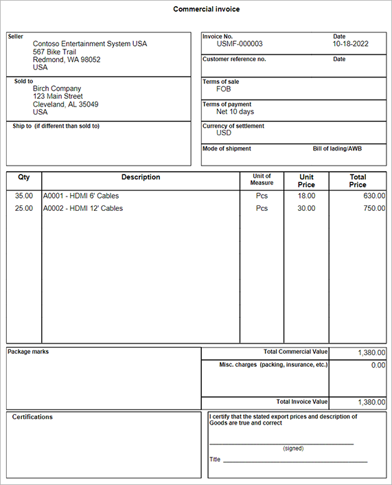

# Commercial invoices

[!include [banner](../includes/banner.md)]

This article describes how to create and print a commercial invoice when you use transportation management processes (TMS).

A commercial invoice is required for the export and import clearance process. It's used for customs, the calculation of tariffs, and the declaration of international commercial terms. Commercial invoices aren't usually required for shipments between European Union (EU) countries, but only between EU countries and non-EU countries. A few countries require that the commercial invoice be on a specific form. However, for most countries, either the seller version or the exporter version is acceptable, provided that all the pertinent information is included.

You can print the commercial invoice for a single shipment from the **All shipments** list page or the **Shipment details** page.

## Document content

The commercial invoice includes the following information, which is prefilled from the shipment that the invoice applies to:

- Invoice number and date
- Seller
- Sold-to address
- Ship-to address
- International commercial terms (Incoterms) (listed as **Terms of sale**)
- Payment terms
- Currency of settlement
- Mode of shipment
- Product details (including quantity, description, unit of measure, unit price, and total price)
- Total commercial value
- Miscellaneous charges
- Total invoice value

If you must change or add data to the commercial invoice, export the generated document to an editable format, such as Microsoft Word. You can then apply any required changes before a declaration is made.

The following illustration shows an example of a commercial invoice.

## Print a commercial invoice

To print a commercial invoice for a shipment, follow these steps.

1. Follow one of these steps to identify the shipment that you want to print a commercial invoice for:

    - Go to **Transportation management \> Planning \> Shipments \> All shipments**, and select the shipment that you want to print the commercial invoice for.
    - Open the **Shipment details** page for the shipment that you want to print the commercial invoice for. There are several ways to open this page (for example, from the **All shipments** page).

1. On the Action Pane, on the **Shipments** tab, in the **Print** group, select **Commercial invoice**.
1. A preview of the document is shown. Use the commands on the Action Pane to print or export the document as you require.
